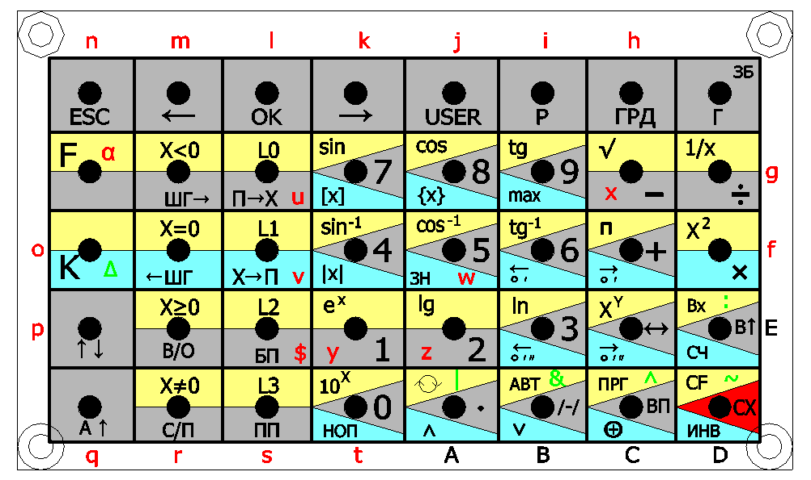

# Проект «Эмулятор микрокалькулятора «Электроника МК-61s mini»

https://github.com/UN7FGO/MK61S_MINI

# Инструкция по работе с БЕЙСИКом

Версия инструкции: 06.07.2026

Эта инструкция описывает встроенный БЕЙСИК, который доступен из меню устройства.
БЕЙСИК не заменяет обычное программирование МК-61, а добавляет поверх него
небольшой текстовый язык для быстрых расчетов, циклов, условий и обмена данными
со стеком и регистрами МК-61.

## Что важно знать заранее

- Программа БЕЙСИКа вводится как одна строка текста.
- Операторы в строке разделяются двоеточием `:`.
- В конце программы обычно ставят `HLT ИМЯ`. Это останавливает выполнение и
  задает имя программы в списке.
- Если имя не задано, программа получит имя вида `BASIC0`, `BASIC1` и так далее;
  в русском интерфейсе они показываются как `БЕЙСИК0`, `БЕЙСИК1`.
- В текущей реализации есть 8 слотов БЕЙСИКа.
- Длина исходника одной программы - до 512 символов.
- Программы БЕЙСИКа хранятся в оперативной памяти и исчезают после сброса или
  выключения питания.
- Переменные и строки очищаются пунктом `Сброс данных`, но сами программы этим
  пунктом не удаляются.
- Ключевые слова языка вводятся латиницей: `IF`, `FOR`, `PRINT`, `HLT`.

## Как открыть БЕЙСИК

1. Нажмите `MENU/ESC`.
2. Клавишами влево/вправо выберите пункт `БЕЙСИК`.
3. Нажмите `OK`.
4. Внутри меню БЕЙСИКа доступны пункты:
   - `Правка` - создать или изменить программу.
   - `Запуск` - выбрать и выполнить программу.
   - `Назначить шаг` - связать программу БЕЙСИКа с шагом программы МК-61.
   - `Сброс данных` - очистить переменные БЕЙСИКа.

## Как ввести первую программу

Пример программы:

```text
? "HELLO":HLT HELLO
```

Она печатает `HELLO` и останавливается. Имя программы в списке будет `HELLO`.

Пошагово:

1. Откройте `MENU/ESC` -> `БЕЙСИК` -> `Правка`.
2. Если программ еще нет, будет выбран пункт `НОВАЯ`. Если программы уже есть,
   клавишами влево/вправо можно выбрать существующую программу или `НОВАЯ`.
3. Нажмите `OK`, чтобы войти в редактор.
4. Введите текст программы.
5. Нажмите `MENU/ESC`. Редактор сохранит текст и сразу скомпилирует программу.
6. Если все хорошо, появится сообщение `БЕЙСИК готов`.
7. Для запуска откройте `БЕЙСИК` -> `Запуск`, выберите `HELLO` и нажмите `OK`.

Важно: в редакторе клавиша `OK` не запускает программу. Она вставляет `:`.
Запуск выполняется только через пункт `Запуск`.

## Клавиши редактора

Верхняя строка дисплея показывает фрагмент исходника и курсор. Нижняя строка
показывает имя программы или `НОВАЯ`, а справа - позицию курсора и длину строки.

На рисунке ниже показано, какой символ вставляет каждая клавиша в обычном
режиме, после `F` и после `K`.



Основные действия:

| Действие | Клавиша |
| --- | --- |
| Сдвинуть курсор влево | стрелка влево |
| Сдвинуть курсор вправо | стрелка вправо |
| Вставить `:` | `OK` или `K`, затем `Вх` |
| Сохранить и выйти | `MENU/ESC` |
| Удалить символ слева | клавиша выбора градусов |
| Очистить весь исходник | `Cx` |
| Ввести цифры и арифметику | обычные цифровые и арифметические клавиши |
| Ввести букву или `$` | `F`, затем нужная клавиша |
| Ввести зеленый символ с рисунка | `K`, затем нужная клавиша |
| Ввести пробел | клавиша `ПП` / `JSR` |

Префиксы `F` и `K` действуют на одну следующую клавишу. После ввода одного
символа редактор снова возвращается к обычной раскладке.

Красная `alpha` на клавише `F` означает, что `F` включает красную буквенную
раскладку на одно следующее нажатие. Зеленая `delta` на клавише `K` означает,
что `K` включает зеленую раскладку на одно следующее нажатие. Сами `F` и `K`
текстовый символ не вставляют.

## Как вводить операторы и слова БЕЙСИКа

Когда курсор стоит там, где должен начаться новый оператор, редактор вставляет
частые операторы целиком. Это работает в начале строки, после `:`, после `;`, а
также после `TH`, `THEN`, `EL` и `ELSE`.

| Что нужно в программе | Что нажать в позиции оператора |
| --- | --- |
| `? ` | `ВП` |
| `IN ` | `Вх` |
| `IF ` | `USER` |
| `FOR ` | `X->П` |
| `NXT ` | `П->X` |
| `GO ` | `БП` |
| `HLT ` | `С/П` |
| `END` | `В/О` |
| `DO` | `ШГ->` |
| `WH ` | `←ШГ` |
| `LD ` | `LOAD` |
| `CLR` | `SAVE` |

Например, чтобы ввести программу:

```text
? "HELLO":HLT HELLO
```

нажмите `ВП`, затем наберите строку `"HELLO"`, нажмите `OK`, нажмите `С/П` и
наберите имя `HELLO`.

Оператор БЕЙСИКа также можно набрать как обычное латинское слово. Например,
`HLT`, `IF`, `FOR`, `NXT`. Буквы вводятся через префикс `F`.

Пример: чтобы ввести `HLT`, нажмите:

```text
F ГРД   F OK   F 0
```

Здесь `F ГРД` дает букву `H`, `F OK` дает `L`, `F 0` дает `T`.

Для частых операторов используйте короткие формы:

| Полная форма | Коротко | Что делает |
| --- | --- | --- |
| `PRINT` | `?` | печать на дисплей |
| `INPUT` | `IN` | ввод числа |
| `THEN` | `TH` | ветка условия |
| `ELSE` | `EL` | ветка иначе |
| `NEXT` | `NXT` | конец цикла `FOR` |
| `WHILE` | `WH` | условие цикла |
| `GOTO` | `GO` | переход к метке |
| `LOAD` | `LD` | загрузка программы МК-61 |
| `STOP` | `HLT` | останов программы |

Основные символы и операции вводятся так:

| Символ | Как нажать |
| --- | --- |
| `?` | `ВП` |
| `:` | `OK` или `K Вх` |
| пробел | `ПП` |
| `+`, `-`, `*`, `/` | соответствующие арифметические клавиши |
| `.` | клавиша десятичной точки |
| `=` | `ШГ->` |
| `<` | `ШГ<-` |
| `<>` | `С/П` в выражении |
| `>=` | `В/О` в выражении |
| `>` | `K -` |
| `~` | `K Cx` / `K CF` |
| `"` | `K X<->Y` |
| `(` | `K *` |
| `)` | `K /` |
| `$` | `F БП` |
| `#` | `K ГРД` |
| `&` | `K +/-` / `K АВТ` |
| вертикальная черта | `K` + клавиша точки |
| `^` | `K ВП` / `K ПРГ` |
| `,` | `K ПП` |

Зеленые буквы на рисунке тоже вводятся через `K`: например, `V` - это `K X->П`,
`W` - `K 5`, `U` - `K П->X`, `Y` - `K 1`, `Z` - `K 2`.

Буквенная раскладка после `F`:

| Буква | Как нажать | Буква | Как нажать |
| --- | --- | --- | --- |
| `A` | `F .` | `N` | `F MENU/ESC` |
| `B` | `F +/-` | `O` | `F K` |
| `C` | `F ВП` | `P` | `F SAVE` |
| `D` | `F Cx` | `Q` | `F LOAD` |
| `E` | `F Bx` | `R` | `F С/П` |
| `F` | `F *` | `S` | `F ПП` |
| `G` | `F /` | `T` | `F 0` |
| `H` | `F ГРД` | `U` | `F П->X` |
| `I` | `F Р` | `V` | `F X->П` |
| `J` | `F USER` | `W` | `F 5` |
| `K` | `F ->` | `X` | `F -` |
| `L` | `F OK` | `Y` | `F 1` |
| `M` | `F <-` | `Z` | `F 2` |

Примеры набора:

```text
? "HELLO":HLT HELLO
IN A:? A*2:HLT DOUBLE
IF A>0 TH ? A EL ? "ZERO"
FOR I=1 TO 5:? I:NXT I:HLT LOOP
```

## Минимальный синтаксис

Печать:

```text
? A
PRINT "TEXT"
```

Присваивание:

```text
A=2+3
LET B=A*10
$A="TEXT"
```

Числовые переменные: `A` - `Z`, а также `A0` - `Z9`.

Строковые переменные пишутся через `$`: `$A`, `$B3`, `$Z9`.
Длина строки - до 24 символов.

Остановка и имя программы:

```text
HLT NAME
STOP NAME
```

`HLT` и `STOP` работают одинаково. Имя после `HLT` или `STOP` используется как
имя программы в списке.

Комментарии:

```text
REM текст комментария
```

## Выражения

Поддерживаются:

- арифметика: `+`, `-`, `*`, `/`, `**`;
- сравнения: `=`, `<>`, `!=`, `<`, `<=`, `>`, `>=`;
- логические операции: `&`, `|`, `^`, `~`;
- скобки;
- числа с десятичной точкой и экспонентой, например `1.25` или `1E-3`.

Встроенные функции:

```text
SIN(X) COS(X) TG(X) TAN(X)
ASIN(X) ACOS(X) ATG(X) ATAN(X)
ABS(X) INT(X) SQRT(X)
```

Возведение в степень пишется как `**`:

```text
A=2**8
```

## Условия

Полная форма:

```text
IF A>0 THEN ? A ELSE ? "ZERO"
```

Короткая форма:

```text
IF A>0 TH ? A EL ? "ZERO"
```

После `TH` и `EL` сейчас выполняется один оператор. Если нужно выполнить несколько
действий, используйте метку и `GO`.

Пример:

```text
A=0:1:A=A+1:IF A<3 TH GO 1:? A:HLT LOOP
```

## Циклы

Цикл `FOR`:

```text
S=0:FOR I=1 TO 5:S=S+I:NXT I:? S:HLT SUM
```

Результат будет `15`.

Можно задать шаг:

```text
FOR I=10 TO 0 STEP -2:? I:NXT I:HLT DOWN
```

Цикл `WH` / `END`:

```text
A=0:S=0:WH A<4:S=S+A:A=A+1:END:? S:HLT WHILE
```

Цикл `DO` / `WH`:

```text
A=0:DO:A=A+1:WH A<3:? A:HLT DOWH
```

## Ввод числа

Оператор `IN` запрашивает число с клавиатуры:

```text
IN A:? A*2:HLT DOUBLE
```

Во время ввода:

- цифры и точка вводят число;
- клавиша выбора градусов удаляет последний символ;
- `Cx` очищает введенное число;
- `OK` завершает ввод.

`IN` предназначен для числовых переменных и ссылок на МК-61. Строковый ввод в
текущей версии не используется.

## Метки и переходы

Метка - это число `0` - `99` или одна буква, после которой стоит `:`.

```text
1:? "AGAIN":GO 1
```

Переход:

```text
GO 1
GOTO A
```

## Работа со стеком и регистрами МК-61

БЕЙСИК может читать и писать стек МК-61:

```text
A=.X
.X=42
.Y=A+1
```

Доступны `.X`, `.Y`, `.Z`, `.T`.

Регистры МК-61 пишутся как `.R0` - `.RE`:

```text
.R0=123
A=.R0
```

Сохранить текущий контекст МК-61:

```text
<MK
```

Восстановить сохраненный контекст:

```text
MK<
```

Контекст включает стек `X`, `Y`, `Z`, `T` и регистры `R0` - `RE`.

## Вызов одной программы БЕЙСИКа из другой

Если имя в выражении совпадает с именем программы БЕЙСИКа, эта программа
выполняется как функция. Аргументы передаются в переменные `A`, `B`, `C`, `D`.
Возвращаемое значение берется из регистра `.X`.

Программа-функция:

```text
.X=A+1:HLT ADD1
```

Программа-вызов:

```text
B=ADD1(41):? B:HLT CALLER
```

Результат будет `42`.

## Загрузка программы МК-61

Оператор `LD` загружает программу МК-61 из библиотеки/FLASH по имени или номеру
слота, записанному как строка:

```text
LD FACTORIAL
LD "5"
```

После загрузки дальнейшее выполнение зависит от обычного режима работы МК-61.

## Назначение БЕЙСИКа на шаг программы МК-61

БЕЙСИК можно связать с шагом программы МК-61, на котором стоит команда `С/П`.
Когда программа МК-61 остановится на этом `С/П`, прошивка запустит назначенную
программу БЕЙСИКа.

Вариант через меню:

1. В обычном режиме МК-61 перейдите к нужному шагу программы.
2. Откройте `MENU/ESC` -> `БЕЙСИК` -> `Назначить шаг`.
3. Выберите программу БЕЙСИКа и нажмите `OK`.

Вариант из БЕЙСИКа:

```text
MK.7=HELLO:HLT BIND
```

Эта строка назначит программу `HELLO` на шаг `7`.

## Примеры

Печать текста:

```text
? "HELLO":HLT HELLO
```

Сумма от 1 до 5:

```text
S=0:FOR I=1 TO 5:S=S+I:NXT I:? S:HLT SUM
```

Удвоение введенного числа:

```text
IN A:? A*2:HLT DOUBLE
```

Записать число в `X` МК-61:

```text
.X=123:HLT SETX
```

Прочитать `X` МК-61 и показать его:

```text
A=.X:? A:HLT SHOWX
```

Сохранить контекст МК-61, выполнить расчет и восстановить контекст:

```text
<MK:A=.X:.X=A*10:MK<:HLT SAVE
```

## Типовые ошибки

`Ошибка БЕЙСИК` и `оператор?` - БЕЙСИК не понял начало оператора. Проверьте
ключевое слово или пропущенное двоеточие.

`нет TH` - после `IF` нет `TH` или `THEN`.

`нет TO` - в цикле `FOR` пропущено `TO`.

`нет END` или `нет NXT` - цикл открыт, но не закрыт правильным оператором.

`нет метки` - `GO` указывает на метку, которой нет в программе.

`нет места` - заняты все 8 слотов БЕЙСИКа.

`цикл завис` - программа превысила внутренний лимит шагов выполнения. Проверьте
условие выхода из цикла.

## Практические советы

- Начинайте с коротких программ и запускайте их сразу после ввода.
- Всегда задавайте имя через `HLT ИМЯ`, иначе в списке будут имена `BASIC0`,
  `BASIC1` и так далее. В русском интерфейсе они показываются как `БЕЙСИК0`,
  `БЕЙСИК1`.
- Для длинной логики используйте короткие имена переменных и метки.
- Если программа не компилируется, сначала проверьте разделители `:` и парные
  скобки.
- Не используйте `LD 5`; для номера слота пишите `LD "5"`.
- После перезагрузки устройства программы БЕЙСИКа нужно ввести заново.
