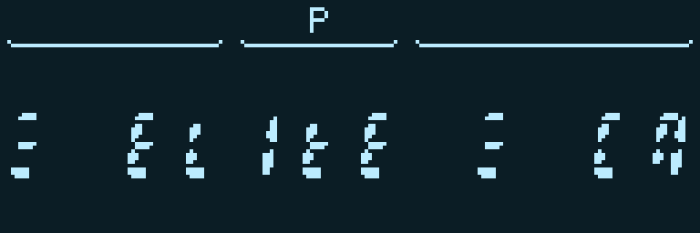
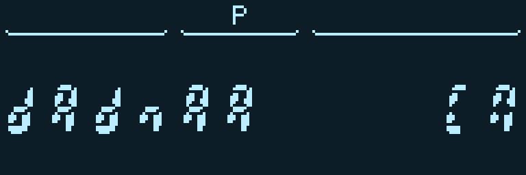
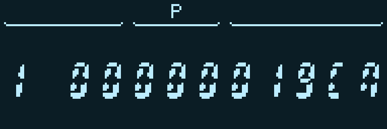
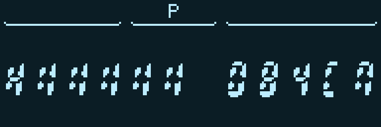
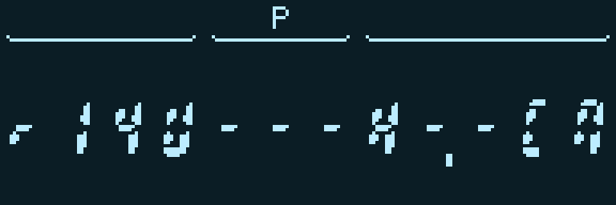
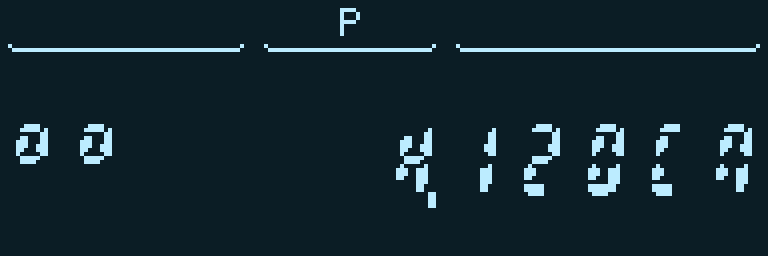
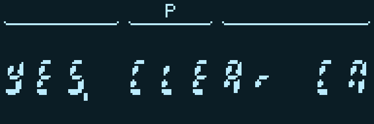

# «Элита» на «МК-61s»

Как и во всех остальных случаях, специально чтобы оттестировать [новые команды](https://bolknote.ru/all/mk-61s-dva-novyh-nabora-komand), я перенёс на «МК-61s» игру. На этот раз, [я об этом уже писал](https://bolknote.ru/all/mk-61s-i-base91), выбрал «Элиту», те, у кого был в детстве какой-либо клон «Спектрума», думаю, очень хорошо её знают.

Безусловно, графику игры, как ни расширяй калькулятор, тут не повторить, но можно реализовать больше логики и кодировать происходящее в игре более понятным образом.

Для начала оказалось, что на индикаторе вполне можно написать название игры. Буквы, конечно, приходится подбирать: одни получаются прописными, другие строчными, а вместо «I» годится единица. Зато справа помещается даже русское «СП» — подсказка, что калькулятор ждёт нажатия «С/П». Три горизонтальные полоски по краям названия — тоже один знак, у которого включены только нужные сегменты.

Хотя у моего экземпляра «МК-61s» экран графический, для самой игры я ограничился двенадцатью знакоместами обычного калькулятора. Иначе было бы слишком просто уйти от исходной задачи. Все картинки ниже сняты с работающего устройства через виртуальный экран.

Внутри получилась небольшая вселенная из 256 миров. Можно торговать шестью товарами — едой, рудой, топливом, электроникой, золотом и оружием, — заправляться, ремонтировать корабль, покупать ракеты и улучшать лазер. Между мирами встречаются пираты, а иногда и те самые таргоиды.

Названия миров я составляю из шестнадцати букв, которые можно более-менее узнаваемо изобразить сегментами. Например, начальный мир называется «dAdnAA». Получается что-то вроде технических обозначений, но от космических названий не обязательно требовать благозвучия.

Имена при этом не просто украшение. Они связаны с устройством мира, в том числе с торговлей, поэтому постепенно можно научиться узнавать полезные места. Всю эту механику заранее раскрывать не хочется: пусть игрок сам попробует разобраться, куда выгоднее возить груз.

Собственно, обычный цикл знакомый: посмотреть цены, купить товар, выбрать соседний мир, долететь, продать. Топливо, которое лежит в трюме, — товар, а бак заправляется отдельно.

С управлением получилось по-калькуляторному: вводишь номер действия и нажимаешь «С/П». Например, `10` показывает цену еды, `30` покупает одну единицу, а `40` продаёт. Для остальных товаров меняется последняя цифра. Во время ввода предыдущая картинка остаётся на экране, набираемый код её не затирает.

Одних чисел мне показалось мало. Состояние корпуса, щита, бака, нагрев и заполнение трюма показываются ещё и шкалой из пяти секций. Точное значение остаётся рядом: шкала нужна, чтобы с первого взгляда понять, много у тебя осталось или мало.

Бои здесь пошаговые. За один ход выбираешь и манёвр, и действие: сблизиться или отойти, выстрелить из лазера или пустить ракету, восстановить щит или готовить бегство. Это снова две цифры: первая отвечает за движение, вторая — за действие. Можно, например, отходить и одновременно заряжать прыжок.

Дистанция имеет значение: лазер не достаёт до далёкой цели, а вблизи стреляет сильнее. Он ещё и греется. Ракет мало, щит не бесконечный, так что бесконечно повторять одну и ту же команду получается не всегда.

Для расстояния я сделал отдельную схему: «U» обозначает наш корабль, «H» — противника, а точка отмечает границу, до которой достаёт лазер. Посмотреть приборы или выбрать цель можно без расходования хода — калькулятор терпеливо подождёт, пока игрок разберётся.

С таргоидами интереснее: у них есть корабль-носитель, который выпускает дронов. Поэтому просто расстрелять большой корабль недостаточно, надо убрать весь строй.

Маленькие кольца слева показывают живых дронов. Правее — выбранная цель и её оставшаяся броня. Для носителя это «H», для дрона — его номер. То есть даже в двенадцать знакомест помещаются несколько противников, выбор цели и число, которое помогает решить, стоит ли тратить на неё ракету.

Ну и надпись после победы тоже удалось сделать человеческой: «YES. CLEAr». За победу дают награду, а затем можно закончить перелёт и вернуться к торговле.

Заодно на игре хорошо стало видно, зачем понадобилось отделять экран от вычислений. Промежуточные числа больше не мелькают перед глазами, а новый кадр появляется целиком. Первая версия медленно заменяла отдельные сегменты, и выглядело это довольно мучительно.

С быстродействием пришлось повозиться отдельно: сокращать обмены между банками, переиспользовать уже вычисленные значения, вспоминать калькуляторные трюки с косвенными переходами. В итоге сама игра с данными занимает 2964 байта, а сжатый файл для загрузки — 1983. Даже немного памяти осталось.

И всё это программа на командах калькулятора, включая мои расширения. Правила торговли и боя исполняет сама ELITE, отдельного встроенного в прошивку движка для неё нет.

[Игра и короткая инструкция](https://github.com/bolknote/MK61S_MINI/tree/main/programs/games/ELITE) лежат в репозитории. Нужна свежая прошивка с новыми командами; открываешь папку ELITE на устройстве, закрываешь памятку и нажимаешь «С/П». Сохранения пока нет, поэтому после повторного запуска космическую карьеру придётся начинать заново.
