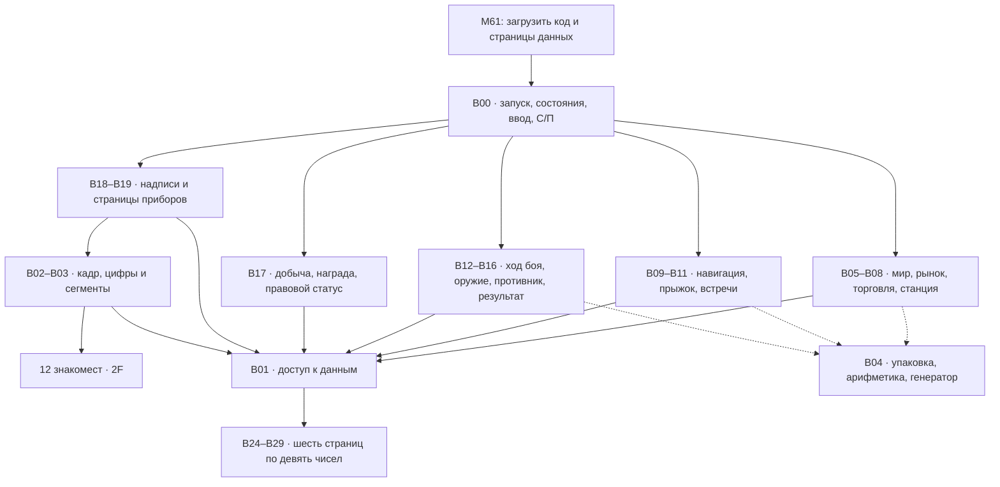
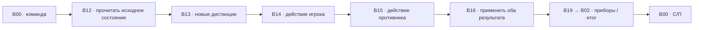

# ELItE: модули, банки и состояние игры

Дата: 22.09.2026. Статус: проект первой версии, до реализации и измерения
размеров машинного кода. Назначение банков — предлагаемое; адреса страниц и
правила обмена ниже согласованы с текущим устройством `1F`, `2F`, `55`, `56`.

Игра выполняется командами МК-61 в расширенном режиме MK61s. M61-сценарии
служат для загрузки. Торговля, генерация миров, бой и вывод работают внутри
программы калькулятора.

## 1. Основания проекта

- Банк содержит 112 байт. Абсолютный адрес: `112 × номер_банка + смещение`.
  Номера банков и адреса в этом документе десятичные, байты команд — hex.
- Диапазон адресов `0000…9999` не означает, что все 90 банков доступны
  одновременно: текущая реализация F401/F411 имеет **32 слота**, включая
  активный банк. Банки данных тоже занимают эти слоты.
- `1F 53 HH LL` вызывает подпрограмму по абсолютному адресу, `52` возвращает.
  Стек возвратов общий, на 64 уровня. Он не сохраняет числовые регистры.
- Переключение программного банка сохраняет текущие R0…RF и общую Ms.
  `55` обменивает R0…R8 с Ms. `56` обменивает первые 63 байта текущего
  программного банка с той же Ms. Ни одна из этих команд не является копированием.
- `2F 50` удерживает экран независимо от вычислений в X. `2F 0E` явно
  записывает маску из X. Все 12 позиций поддерживают произвольные сегменты.
- Числа состояния — целые с не более чем восемью значащими десятичными
  цифрами. Ограничение действует и на промежуточные результаты упаковки.

Источники: [описание расширений](../src/MK61s-mini-Extended-Opcodes.md),
[ядро](../../code/mk61emu_core.cpp),
[проверки обменов и дальних вызовов](../../tests/mk_math_self_test.cpp),
[сценарии M61](../src/MK61s-mini-M61.md).

## 2. Общая схема



Это схема зависимостей, а не загрузка модулей с диска во время игры. Код
уже лежит в назначенных банках. `1F` выбирает нужное 112-байтовое окно.
Модули возвращают результат диспетчеру; только B00 содержит штатные остановы
`С/П`. Переход между режимами не наращивает стек вызовов.

## 3. Карта банков

Каждый одиночный банк ниже — бюджет в 112 байт, а не утверждение, что модуль
уже собран и поместился. Внешние вызовы используют метки, которые сборщик
превратит в абсолютные адреса. После первых листингов крупный модуль можно
расширить на резервный банк, сохранив его основную точку входа.

| Банк | Адреса | Модуль | Что находится внутри |
|---|---|---|---|
| B00 | 0000–0111 | KERNEL | Новая игра, заставка, режим, ввод команды, диспетчер, ожидание С/П |
| B01 | 0112–0223 | DATA | Короткие обработчики чтения, записи и инициализации полей страниц |
| B02 | 0224–0335 | DISPLAY | Построение кадра, сравнение с предыдущим, публикация изменённых позиций через 2F |
| B03 | 0336–0447 | GLYPH | Маски цифр и букв алфавита миров; преобразование кода символа в маску |
| B04 | 0448–0559 | MATH | Выделение упакованных полей, остатки, ограничение диапазонов, шаг генератора |
| B05 | 0560–0671 | WORLD | Генерация мира по координатам, шесть знаков имени, извлечение свойств |
| B06 | 0672–0783 | MARKET | Базовые цены, поправки мира, текущего события и наличия товара |
| B07 | 0784–0895 | TRADE | Проверка и проведение покупки/продажи: деньги, трюм, запас рынка |
| B08 | 0896–1007 | STATION | Заправка, ремонт, ракеты и улучшения корабля |
| B09 | 1008–1119 | NAV | Выбор цели, расстояние, дальность двигателя, требуемое топливо |
| B10 | 1120–1231 | JUMP | Расход топлива, время полёта, прибытие или перехват в пути |
| B11 | 1232–1343 | CONTACT | Выбор встречи, пираты/полиция/торговцы, характеристики обычного врага |
| B12 | 1344–1455 | COMBAT | Подготовка боя, выбор цели, последовательность фаз одного хода |
| B13 | 1456–1567 | MOTION | Сближение, отход, уклонение, инерция, дистанции до целей |
| B14 | 1568–1679 | WEAPON | Лазер, ракета, щиты, нагрев, заряд гиперпрыжка |
| B15 | 1680–1791 | ENEMY | Решение противника; цикл таргоида и выпуск/атаки таргонов |
| B16 | 1792–1903 | RESOLVE | Одновременный урон, применение изменений, победа/поражение/уход |
| B17 | 1904–2015 | REWARD | Однократная награда, добыча, счёт побед и розыск |
| B18 | 2016–2127 | TEXT | Заставка и фиксированные сообщения: YES. CLEAr, dEAd, SAFE, СП |
| B19 | 2128–2239 | HUD | Страницы приборов, цены и числовые значения; форматирование кадра |
| B20–B23 | 2240–2687 | Резерв кода | Расширение модулей после измерения размера, прежде всего ядра и вывода |
| B24 | 2688–2799 | PILOT | Капитан, текущий мир, состояние корабля и генератор |
| B25 | 2800–2911 | HOLD | Шесть товаров, оборудование, ракеты, рейтинг/розыск |
| B26 | 2912–3023 | MARKET_STATE | Запасы текущего рынка, идентификатор мира, время и событие |
| B27 | 3024–3135 | COMBAT_STATE | Главная цель, движение, ход, выбранная цель, заряд прыжка, исход |
| B28 | 3136–3247 | DRONES | До пяти таргонов и число уже выпущенных |
| B29 | 3248–3359 | FRAME | Новый и последний опубликованный кадры индикатора |
| B30–B31 | 3360–3583 | Общий резерв | Дополнительный код или состояние по результатам первого рабочего варианта |

Итого в исходном распределении: **20 банков кода + 6 банков данных = 26
слотов**, ещё 6 свободны. Резерв не надо заранее загружать: даже запись
заполнителя занимает слот. Бюджет кода — 2240 байт, общий резерв — 672 байта.
Шесть страниц данных дают 54 числовых слова, их обменные области занимают
378 байт. Хвосты этих банков содержат процедуры доступа.

## 4. Устройство страницы данных

У каждой B24…B29 одна и та же физическая раскладка:

```text
Смещение   0 .................................. 62 | 63 .... 69 | 70 ... 111
           девять чисел в формате обмена 55/56   | процедура | резерв хвоста
           63 байта                              | 7 байт    | 42 байта
```

63 байта — образ обменной области, включая служебные тетрады. Это не массив
девяти обычных восьмизначных ASCII-чисел и не девять машинных double.
Инициализация должна получить корректное представление из операций ядра
либо из упаковщика, проверенного на этих операциях.

Процедура доступа начинается строго вне обменной области:

| Смещение | Байты | Действие |
|---|---|---|
| 63 | `56` | Обменять первые 63 байта этой страницы с Ms |
| 64 | `55` | Поместить девять чисел страницы в R0…R8; рабочие R0…R8 уходят в Ms |
| 65 | `1F AF` | Вызвать короткий обработчик по абсолютному адресу из RF |
| 67 | `55` | Вернуть рабочие R0…R8; изменённые данные страницы отправить в Ms |
| 68 | `56` | Сохранить данные обратно в страницу и восстановить прежнюю Ms |
| 69 | `52` | Вернуться к вызывающему модулю |

После успешного возврата R0…R8 и Ms вызывающего кода восстановлены. Результат
чтения передаётся через RC, который не участвует в `55`.

| Страница | Адрес процедуры |
|---|---|
| B24 PILOT | 2751 |
| B25 HOLD | 2863 |
| B26 MARKET_STATE | 2975 |
| B27 COMBAT_STATE | 3087 |
| B28 DRONES | 3199 |
| B29 FRAME | 3311 |

Например, `1F 53 27 51` вызывает процедуру B24. Число 2751 — абсолютный
адрес, а не «банк 27, шаг 51».

Обработчик получает RB = номер поля 0…8, RC = записываемое значение для
записи. При чтении возвращает значение в RC. RF содержит адрес обработчика
GET, PUT или INIT из B01. Для этих указателей выбраны старшие регистры:
дальние косвенные команды через R0…R6 имеют автоизменение регистра.

**Вложенный обмен запрещён.** Обработчик не открывает другую страницу, не
вызывает игровые модули, не ждёт С/П и всегда возвращается через `52`.
Он меняет только нужные поля и пользуется стеком и разрешёнными временными
регистрами. Другую страницу открывает вызывающий код после полного возврата.
Игровые модули не используют `55/56` напрямую.

Для покупки нескольких полей разных страниц сначала читаются исходные
значения и проверяется возможность операции, затем последовательно
записываются новые. Штатного ожидания пользовательского ввода посередине нет.
Это порядок выполнения в RAM; он не обещает сохранность при отключении питания.

## 5. Числовые регистры и владение данными

| Регистры | Назначение | Правило |
|---|---|---|
| X, Y, Z, T, X1 | Арифметика и входные значения | Временные; долговременное состояние здесь не хранится |
| R0…R8 | Рабочие числа текущего модуля | Обычно временные; внутри процедуры страницы — её девять полей |
| R9 | Режим игры | Меняет только KERNEL; все подпрограммы сохраняют |
| RA | Выбранная страница интерфейса | Меняет только KERNEL; не является игровым ходом |
| RB | Номер поля или аргумент операции | Временный; для DATA это индекс 0…8 |
| RC | Передаваемое значение/результат | Временный; переживает обмен R0…R8 |
| RD | Временное число | Не сохраняется обычными вызовами |
| RE | Временное число или полный адрес процедуры страницы | Не сохраняется обычными вызовами |
| RF | Полный адрес короткого обработчика | Не сохраняется обычными вызовами |
| Ms | Обменный буфер | Принадлежит только процедуре страницы; после возврата восстановлен |

Обычный дальний вызов сам по себе не защищает рабочие регистры. Для каждой
точки входа в исходнике перечисляем аргументы, результат и изменяемые
регистры. KERNEL не держит важные данные в R0…R8 между вызовами модулей.
Процедура страницы гарантирует сохранение этой девятки, обычная подпрограмма
гарантирует только явно оговорённое.

## 6. Поля страниц состояния

### B24 PILOT

| Поле | Значение | Диапазон первой версии |
|---|---|---|
| R0 | Кредиты | 0…99 999 999, целые |
| R1 | Код текущего мира | 0…16 777 215 |
| R2 | Код выбранного мира назначения | 0…16 777 215 |
| R3 | Игровое время | Целый счётчик; меняется при действиях, не при просмотре |
| R4 | Корпус | 0…99 |
| R5 | Щит | 0…99, предел зависит от оборудования |
| R6 | Топливо двигателя | 0…99 условных единиц |
| R7 | Нагрев | 0…99 |
| R8 | Состояние игрового генератора | 0…65 535 |

### B25 HOLD

| Поле | Значение |
|---|---|
| R0 | Еда |
| R1 | Руда |
| R2 | Топливо как товар в трюме |
| R3 | Электроника |
| R4 | Золото |
| R5 | Оружие как товар |
| R6 | Оборудование: `LLSSJJCC` — лазер, щит, двигатель, вместимость |
| R7 | Число ракет |
| R8 | `wanted × 1 000 000 + kills`: розыск и счёт побед |

Количество каждого товара 0…99; сумма не превышает CC, также 0…99. Топливо
в трюме и топливо в баке имеют разные назначения; перевод между ними
выполняется отдельной операцией. Все компоненты LL/SS/JJ/CC двухзначные,
но допустимые уровни оборудования задаются правилами станции. У wanted две
цифры, у kills шесть; переполнение поля не переносится в соседнее поле.

### B26 MARKET_STATE

| Поле | Значение |
|---|---|
| R0 | Код мира, которому принадлежит рынок |
| R1 | Игровое время формирования рынка |
| R2 | Код местного события: обычное состояние, дефицит и т. п. |
| R3…R8 | Наличие шести товаров в том же порядке, что в HOLD |

Цены вычисляются, а не дублируются в памяти. Покупка уменьшает наличие и
меняет последующие предложения; продажа увеличивает. В первой версии
сохраняется текущий рынок. При новом прибытии рынок определяется миром и
временем: долгосрочную историю всех 256 рынков этот бюджет не хранит.

### B27 COMBAT_STATE

| Поле | Значение |
|---|---|
| R0 | Тип встречи/главного противника |
| R1 | Прочность главного противника, 0…999 |
| R2 | Дистанция, 1…99 |
| R3 | Относительная скорость, на первом этапе −4…4 |
| R4 | Номер боевого хода |
| R5 | Выбранная цель: 0 — главный корабль, 1…5 — таргон |
| R6 | Заряд гиперпрыжка, 0…100 |
| R7 | Исход и признак уже выданной награды |
| R8 | Параметры противника: оборудование/особенности встречи |

Корпус, щит и нагрев игрока остаются в PILOT: второй постоянной копии нет.
Фаза таргоида выводится из номера хода, поэтому отдельно не сохраняется.
Точное кодирование R7/R8 закрепляется вместе с первым боевым модулем.

### B28 DRONES

| Поле | Значение |
|---|---|
| R0…R4 | Таргоны 1…5: `100 × distance + hull` |
| R5 | Сколько таргонов уже выпущено, 0…5 |
| R6…R8 | Резерв состояния противника |

У таргона дистанция и прочность двухзначные. Ноль — пустое или уничтоженное
место; живой таргон имеет ненулевую прочность. После уничтожения носителя
все пять записей обнуляются. Для обычного противника страница пуста.

### B29 FRAME

| Поле | Значение |
|---|---|
| R0…R3 | Четыре слова желаемого кадра, по три маски в каждом |
| R4…R7 | Четыре слова последнего опубликованного кадра |
| R8 | Достоверность предыдущего кадра: 0 при старте, 1 после публикации |

Три последовательные маски упаковываются как `a + 256b + 65536c`.
Максимум 16 777 215 точно укладывается в восемь десятичных цифр, включая
маски с точкой. DISPLAY меняет на индикаторе только отличающиеся позиции.
Другие модули не используют FRAME как арифметическую рабочую память.

## 7. Генерация миров и алфавит

Для первой версии фиксируем сектор 16 × 16, до 256 миров. По координатам и
постоянному seed сектора WORLD воспроизводимо получает четыре свойства.
Код мира содержит шесть шестнадцатеричных цифр:

```text
экономика | технологии | закон | ресурсы | координата X | координата Y
    e           t          l        r           x              y

world = e·16⁵ + t·16⁴ + l·16³ + r·16² + x·16 + y
```

Так один восьмизначный десятичный регистр хранит и имя, и паспорт мира.
При одинаковых координатах генератор всегда возвращает тот же мир; два
произвольно набранных имени с одинаковыми координатами не считаются двумя
разными планетами сектора.

Предлагаемый исправленный алфавит из 16 знаков: `AbCdEFGHLnOPrtUY`.
`O` включена; `n` — строчная. Это алфавит кодирования имён, а не полный
набор символов интерфейса. Для надписей дополнительно используются цифры,
`I`, `S`, кириллическая `П`, точки и произвольные маски вроде `三`.

Базовые цены — функция свойств мира и типа товара. Чтобы не тратить несколько
банков на таблицу 16 × 6 коэффициентов, первая модель использует шесть базовых
цен и короткие формулы поправок. Текущие запасы и события дают динамику.
Конкретные коэффициенты — отдельная задача баланса.

Для воспроизводимых встреч предлагаем собственное небольшое состояние RNG
в PILOT. Возможный первый вариант: `s = (253s + 13849) mod 65536`.
Промежуточное число не превышает 16 594 204. При создании партии seed можно
получить через `К СЧ`, затем переходы игры воспроизводимы. Просмотр рынка,
имени и приборов не делает шаг RNG. WORLD использует отдельное локальное
вычисление от координат и постоянного seed, не изменяя генератор встреч.

## 8. Ход боя и работа с несколькими страницами



Это порядок вычисления одновременного хода. До RESOLVE не уменьшаем прочность
целей: корабль, уничтоженный этим залпом, ещё участвует в текущем обмене огнём.
Дистанции для обеих сторон берём после манёвра. Никаких вызовов страницы
данных внутри уже открытой страницы.

Рабочая девятка COMBAT между B13…B16 имеет отдельный договор:

| Регистр | Рабочее значение |
|---|---|
| R0 | Принятая команда «манёвр + действие» |
| R1 | Цель этого хода |
| R2 | Новая дистанция до главного противника |
| R3 | Новая относительная скорость |
| R4 | Щит игрока после выбранного действия, до попаданий |
| R5 | Нагрев после выбранного действия |
| R6 | Суммарный входящий урон до поглощения щитом |
| R7 | Урон выбранной цели |
| R8 | Новая готовность гиперпрыжка |

MOTION записывает R2/R3, WEAPON — R4/R5/R7/R8, ENEMY — R6. COMBAT до
этого заполняет R0/R1 и исходные значения остальных полей. RESOLVE читает
подготовленный набор и записывает постоянные страницы. Подпрограммы
B13…B16 изменяют только закреплённые за ними поля этого набора.
Чтение страниц через DATA его сохраняет. Новые расстояния до таргонов можно
повторно вычислить из старой записи и манёвра; хранить пять дополнительных
копий заранее не нужно. Расход ракеты и топлива применяется в RESOLVE один
раз, после проверки действия.

Для таргоида ENEMY выбирает фазу из `turn mod 3`: зарядка, залп, выпуск
таргона. В фазе выпуска предусмотрено окно для ракеты. Числа урона,
порог нагрева и длительность зарядки остаются параметрами баланса.

После RESOLVE исход передаётся KERNEL. Победа отключает таргонов и приводит
к однократному расчёту награды B17. Затем показывается результат. Повторный
просмотр страницы или нажатие С/П не начисляет награду снова. При взаимном
уничтожении приоритет у поражения, как в текущем макете.

## 9. Стабильный индикатор и заставка

При входе в игру: `2F 50`, затем `2F 2A`. Обычные расчёты и ввод чисел не
публикуются автоматически. UI готовит желаемые 12 масок в FRAME. DISPLAY
выбирает позицию 0 командой `2F 00` и проходит все 12 позиций: отличающуюся
маску пишет через X и `2F 0E`, неизменившуюся пропускает через `2F 25`.
Оба пути сдвигают курсор; изменять байт позиции в коде не требуется.

Во время обычной смены страницы не вызываем `2F 0D`: старый кадр остаётся
видимым, пока записываются новые символы. После вывода KERNEL очищает
арифметический X обычным `Cx` и останавливается командой `50`; это подготавливает
ввод следующей команды, не стирая надпись. Между ходами все вызовы и обмены
завершены, С/П возобновляет диспетчер.

Это убирает мигание от изменения X и промежуточной очистки. У `2F` сейчас нет
атомарной публикации целого кадра: короткое смешение старых и новых символов
при самой перезаписи не следует называть гарантированно устранённым.

Первая заставка по предложению пользователя:

```text
三 ELItE 三 СП
```

Ровно 12 знакомест. `三` — три горизонтальных сегмента A+D+G, маска `49` hex.
Полный кадр масок слева направо:

```text
49 00 79 38 06 78 79 00 49 00 39 37
```

При запуске сначала инициализируются служебные регистры и FRAME, затем
TEXT задаёт константы, DISPLAY их публикует, KERNEL ждёт С/П. Инициализация
состояния новой партии выполняется после этого нажатия. Тексты результатов:

```text
YES. CLEAr СП   победа; точка входит в маску S
dEAd      СП   поражение
SAFE      СП   удалось уйти
```

В аппаратном кадре после dEAd/SAFE ровно шесть пустых ячеек до СП. Пробелы
и точки формируются масками, а не подсчётом длины текстовой строки с точкой.
Приборы и выбор цели — запросы без расхода хода. Числовая команда боевого
действия остаётся двузначной: первая цифра манёвр, вторая действие.

## 10. Исходники, загрузка и сохранения

Предлагаемая структура будущей реализации:

```text
elite/
  banks.toml           назначение банков, экспортируемые метки и лимиты
  abi.md               аргументы, результаты и изменяемые регистры
  src/                 отдельные исходники KERNEL, DATA, WORLD, COMBAT…
  data/                алфавит, сообщения, начальные значения
  build/elite.map      фактические адреса и расход каждого банка
  build/autoexec.m61   reinit, последовательная загрузка файлов, run
  build/b00.m61 …      строки hin с абсолютными адресами
```

Это проект структуры; сборщик и файлы игры этим документом не реализованы.
На первом этапе можно формировать и проверять строки `hin` отдельным
упаковщиком. Один загружаемый банк требует около 234 символов строки, что
вмещается в отдельный M61-файл. `autoexec.m61` открывает эти файлы последовательно;
не требуется цепочка вложенности по числу банков. `reinit` исполняется один
раз до загрузки и освобождает состояние предыдущей программы.

Упаковщик должен отклонять выход модуля за выделенные 112 байт, пересечение
кода и данных, переход на операнд команды, загрузку более 32 банков и
неправильные BCD-адреса. Многобайтовые команды в нашей сборке не пересекают
границу банка: остаток заполняется, следующий модуль начинается по своей метке.

Сохранения первой версии — отдельный формат данных PILOT + HOLD + MARKET_STATE
на безопасной паузе у станции. Одного дампа активных R0…RF или банка 0 для
сохранения игры недостаточно. Наличие многобанкового долговременного save/load
не предполагается автоматически: перед добавлением этого пункта нужен
проверенный путь выгрузки и восстановления всех нужных страниц. Резервные
банки в этой схеме пока не заняты контрольными копиями.

## 11. Порядок реализации

1. **Основа:** B00/B01 и одна страница B24. Проверить вызов процедуры с позиции
   63, чтение и запись поля, восстановление R0…R8/Ms и возврат в исходный банк.
   Это первый обязательный опыт: схема составлена по реализации команд,
   но вся последовательность ещё должна быть проверена как программа.
2. **Экран:** B02/B03/B18/B19/B29. Заставка, С/П, прибор с числом, смена X
   при неподвижной надписи, сравнение кадров, все 12 позиций.
3. **Минимальная торговая петля:** B05…B10, B25/B26. Два мира, один товар,
   прыжок и возвращение; затем шесть товаров, оборудование и весь сектор.
4. **Один противник:** B11…B14/B16/B27. Прочитать исходные значения, вычислить
   обе атаки, применить их один раз; победа, поражение и уход.
5. **Таргоид:** B15/B28. Пять таргонов, окно для ракеты, уничтожение носителя.
6. **Награды и баланс:** B17, все цены и ограничения, затем проверенный save/load.

После каждого этапа обновляется карта фактических размеров. Резерв выдаётся
по измеренному переполнению конкретного модуля. До первого листинга нельзя
считать доказанным, что полная игра помещается в предложенные 26 банков.
