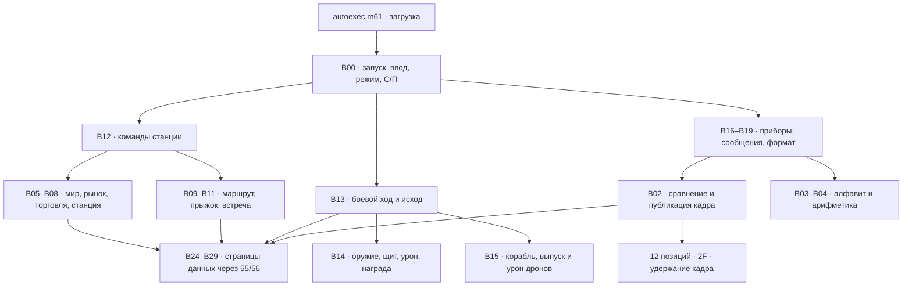

# ELITE: реализованная схема банков и регистров

22.09.2026. Первая играбельная версия. Этот документ описывает собранную
программу; первоначальные бюджеты модулей заменены фактическим размещением.

Игра выполняется командами МК-61. M61-сценарии только загружают 32 банка.
Python используется при сборке на компьютере, а не во время игры.
[Правила и сборка](../../tools/elite/README.md),
[точная карта меток](../../tools/elite/elite.map.json),
[расширенные команды](../src/MK61s-mini-Extended-Opcodes.md).

## Модули



Номер здесь указывает основной банк модуля. Крупные модули продолжаются
в свободных участках других банков. Сборщик расставляет переходы `1F`,
не разрывает инструкции и таблицы, проверяет отсутствие пересечений.
Общий стек возвратов используется штатно: режим меняется после возврата,
а не цепочкой незавершённых вызовов. Только ядро останавливается на С/П.

## Фактическое размещение

Банк — 112 байт. Адрес = номер банка × 112 + смещение. Все номера и адреса
ниже десятичные; байты команд в листингах — hex. Загружаются B00…B31,
то есть **все 32 аппаратных слота**, включая шесть банков данных.
Незагруженных резервных банков нет. Свободные байты распределены по хвостам;
они не образуют один непрерывный блок для нового модуля.

Занято **3519 из 3584 байт**, свободно 65. Число включает код,
378 байт числовых страниц и 114 байт процедур обмена.

| Банк | Адреса | Размещённые модули |
| --- | --- | --- |
| B00 | 0000–0111 | kernel |
| B01 | 0112–0223 | initialization / combat |
| B02 | 0224–0335 | display / combat |
| B03 | 0336–0447 | glyphs |
| B04 | 0448–0559 | arithmetic |
| B05 | 0560–0671 | world / enemies |
| B06 | 0672–0783 | prices / enemies |
| B07 | 0784–0895 | trade |
| B08 | 0896–1007 | station |
| B09 | 1008–1119 | navigation / combat |
| B10 | 1120–1231 | flight |
| B11 | 1232–1343 | contacts / combat views |
| B12 | 1344–1455 | input / combat views |
| B13 | 1456–1567 | combat |
| B14 | 1568–1679 | weapons |
| B15 | 1680–1791 | enemies |
| B16 | 1792–1903 | combat views |
| B17 | 1904–2015 | views |
| B18 | 2016–2127 | messages |
| B19 | 2128–2239 | format / combat views |
| B20 | 2240–2351 | kernel / flight / combat views |
| B21 | 2352–2463 | views |
| B22 | 2464–2575 | views / combat |
| B23 | 2576–2687 | messages / combat views |
| B24 | 2688–2799 | data / combat |
| B25 | 2800–2911 | data / combat |
| B26 | 2912–3023 | data / combat |
| B27 | 3024–3135 | data / combat / combat views |
| B28 | 3136–3247 | data / weapons |
| B29 | 3248–3359 | data / enemies |
| B30 | 3360–3471 | trade / combat |
| B31 | 3472–3583 | station / combat |

## Обмен и все шестнадцать регистров

| Регистры | Назначение |
| --- | --- |
| R0…R8 | Рабочие значения; при открытой странице — её девять полей |
| R9 | Режим: 0 — заставка, 1 — станция, 2 — бой, 3 — победа/побег, 4 — гибель |
| RA | Номер страницы приборов; после исхода — адрес обработчика сообщения |
| RB | Индекс поля, позиция символа или индекс цикла |
| RC | Аргумент/результат обмена, выводимое число |
| RD, RE | Дополнительные аргументы, арифметика, адрес таблицы/процедуры |
| RF | Адрес обработчика для `1F AF`; внутри обработчика — временное значение |
| X, Y, Z, T, X1 | Арифметический стек, временные значения |
| Ms | Общий обменный буфер, после закрытия страницы восстановлен |

RF — полноценный шестнадцатый регистр. Его обязательно учитывают сборщик,
диспетчер и обработчики. RB…RF не участвуют в `55`; это позволяет передавать
аргументы сквозь обмен девятки R0…R8. Сам дальний вызов регистры не сохраняет.

У каждой B24…B29 одинаковая раскладка:

```text
  0…62  девять чисел по 7 байт, точный формат обмена 56
 63…69  READ:  56 55 DB 4C 55 56 52
 70…75  WRITE: 56 55 6C BB 51 67
 76…81  CALL:  56 55 1F AF 51 67
 82…111 дополнительный код, который команда 56 не затрагивает
```

`51 67` — ближний переход на общий эпилог страницы в смещении 67.
В таблице байты `67` являются BCD-кодом десятичного смещения 67.

- READ: RB = индекс 0…8; результат в RC и X.
- WRITE: RB = индекс, RC = новое значение.
- CALL: RF = абсолютный адрес короткого обработчика; аргументы RC…RE.
- Открытие: `56 → 55`. Данные страницы оказываются в R0…R8,
  рабочие значения вызывающего кода временно лежат в Ms.
- Закрытие: `55 → 56`. Рабочая девятка и Ms восстанавливаются,
  изменённая страница записывается в свой банк.

Команды `55/56` оставляют X без изменения. Поэтому READ возвращает значение
без лишнего повторного вызова регистра. Вложенное открытие другой страницы
внутри обработчика запрещено. Из обработчика можно вызывать чистую
арифметику; штатная остановка или переход к игровому диспетчеру запрещены.
R9 и RA обработчики сохраняют. Все короткие обработчики завершаются `52`.

| Страница | READ | WRITE | CALL |
| --- | --- | --- | --- |
| B24 | 2751 | 2758 | 2764 |
| B25 | 2863 | 2870 | 2876 |
| B26 | 2975 | 2982 | 2988 |
| B27 | 3087 | 3094 | 3100 |
| B28 | 3199 | 3206 | 3212 |
| B29 | 3311 | 3318 | 3324 |

## Постоянные данные

| Банк | Поля R0…R8 |
| --- | --- |
| B24 PILOT | деньги, текущий мир, выбранный мир, время, корпус, щит, бак, нагрев, ГСЧ |
| B25 HOLD | шесть товаров; оборудование; ракеты; счёт побед |
| B26 MARKET | мир, время создания, резерв, шесть запасов товара |
| B27 COMBAT | тип врага, корпус, дистанция, последний манёвр, ход, цель, заряд, два резерва |
| B28 DRONES | корпуса пяти дронов, всего выпущено, живых сейчас, два резерва |
| B29 FRAME | четыре слова нового кадра, четыре последнего кадра, временная маска |

Товары: еда, руда, товарное топливо, электроника, золото, оружие.
Поле оборудования `LLSSJJCC`: уровень лазера, щита, двигателя, трюма.
Начальное значение 01010420; лазер можно улучшить до 03, остальное
в этой версии фиксировано. Ракет не более 9. В трюме суммарно не более 20.
Щит ограничен 60, корпус и бак — 99. Номер цели 0 — главный корабль,
1…5 — соответствующий дрон. Заряд прыжка хранится как число ходов 0…4.

В этой реализации дроны имеют отдельную прочность, но общую дистанцию
строя. Поэтому их поля содержат корпус 0…18, а не упаковку дистанции
с корпусом из первоначальной схемы. Счётчик живых поддерживается при
выпуске и уничтожении; не пересчитывается дорогим циклом каждый ход.

Деньги ограничены 99 999 999. Числа миров и кадров используют максимум
восемь десятичных значащих цифр. Большие упакованные целые разбираются
через `n - floor(n/base) * base`; извлечение через дробную часть деления
на ПЗУ теряет младшие разряды. Степени 256 для кадров выбираются как
целые 1, 256, 65536; вещественная функция степени для этого не используется.

## Миры, рынок, перелёт

Координаты: `N = 16*y + x`, 0…255. Код мира:

```text
seed = (251*N + 12345) mod 65536
world = 256*seed + N
```

Каждая из шести шестнадцатеричных цифр world выбирает букву из
`AbCdEFGHLnOPrtUY`. Первая задаёт экономику `e`, вторая опасность,
последние две — координаты y и x. O отображается как 0. Все 256 имён
проверены исполнением калькуляторного форматирования.

Для товара g=0…5 базовая цена `(g+1)*(g+2)*10`.
Цена покупки: `max(1, floor(base*(80+5*((e+2*g) mod 16))/100)
+ 2*(30-stock))`. Цена продажи: `max(0, price-4)`.
Разница цен предотвращает прибыль от немедленной обратной сделки
на том же рынке. При прилёте каждый запас равен 30, максимум после
продаж — 99. Долговременной памяти рынков всех планет пока нет.

Манхэттенское расстояние не более 4; столько же топлива уходит на прыжок.
ГСЧ: `(253*s + 13849) mod 65536`, начальное s=12345. Остаток 0 по модулю
16 даёт tHArGOId; остальные значения меньше `2+floor(danger/4)` — пирата.
Другие значения означают спокойный перелёт. ГСЧ меняется при прыжке;
просмотр страниц его не сдвигает. При посадке щит восстанавливается до 60,
нагрев обнуляется. Корпус и боезапас сохраняют полученные изменения.

## Боевой ход

1. Проверить код действия и наличие ракеты до изменения состояния.
2. Манёвр 1 уменьшает дистанцию на 2, 2 сохраняет, 3 увеличивает на 2;
   4 оставляет дистанцию и включает уклонение. Диапазон 0…99.
3. Остудить оружие на 10. Если после этого нагрев меньше 70, лазер
   наносит `12*уровень+20-дистанция` и добавляет 28 нагрева.
   Дальность лазера — 18. За её пределами выстрел греет оружие,
   но не повреждает цель. При перегреве выстрела нет, ход проходит.
4. Ракета наносит 45 на любой дистанции; щит вместо выстрела получает
   +18 до предела 60. Заряд прыжка вместо выстрела растёт на 1;
   другое действие обнуляет его. Просмотр/выбор цели заряду не мешают.
5. Пират стреляет на 14, носитель на 18, каждый уже живой дрон на 3.
   Их дальность — 18. Уклонение делит и входящий, и исходящий урон
   на два с округлением вниз: меньший риск ценой меньшей эффективности.
6. Живой носитель выпускает дрон на каждом третьем ходу, максимум пять
   за встречу. Новый дрон начинает стрелять со следующего хода.
7. Разрешить оба залпа: уничтоженная цель всё равно успевает выстрелить
   в этом ходу. Урон сначала снимает щит, затем корпус игрока.
8. При нуле корпуса игрока — `dEAd`. Иначе ноль корпуса главной цели
   и отсутствие живых дронов — `YES. CLEAr`, +250 кредитов и одна победа.
   Иначе заряд 4 — `SAFE`. При взаимном уничтожении награды нет.

У пирата корпус 60. У носителя 120, изначально два дрона по 18.
Победа над одним носителем при оставшихся дронах бой не завершает.
Награда выдаётся при смене режима, поэтому просмотр результата
не начисляет её повторно. Следующее С/П после победы или побега
завершает прибытие; после гибели начинает новую игру.

## Индикатор и проверка

На старте `2F 50` удерживает вывод, `2F 2A` включает сегменты.
Кадр содержит 12 масок; три соседних маски упакованы в одно число:
`a + 256*b + 65536*c`. Точка — бит 7 маски, отдельной позиции не занимает.
B29 хранит новый и предыдущий кадры. Вывод сравнивает позиции, изменённые
публикует `2F 0E`, неизменённые пропускает `2F 25`. Промежуточные вычисления
и набор команды не публикуются; перед обновлением экран не очищается.

Заставка: `三 ELItE 三 СП`, маски
`73,0,121,56,6,120,121,0,73,0,57,55`.
СП постоянно занимает позиции 10 и 11 и означает ожидание С/П.
Первые и последние позиции допускают все сегменты.

После арифметики перед дальним условием сборщик добавляет NOP (`54`),
если нужно дать ПЗУ завершить запись X до его чтения префиксом `1F`.
Это не изменяет стек и устраняет воспроизведённую ошибку проверки
недостаточного баланса. Ближние условия выполняет само ПЗУ.

`tests/run_elite_tests.sh` собирает драйвер настоящего ядра и выполняет
сценарии клавишами. Проверяются все миры, транзакции и отказы, маршруты,
сохранность данных между банками, бой, дроны, все исходы, глубина возвратов
и неизменность кадра во время ввода. Чистое повторное отображение также
проверяется по отсутствию изменения счётчика публикаций дисплея.

Аппаратный запуск на физическом MK61s ещё не проводился. Автосохранение,
миссии, полиция, розыск, отдельное движение каждого дрона и дальнейшие
типы оборудования в эту первую версию не входят.
