# Проект «Эмулятор микрокалькулятора Электроника МК-61s mini»

https://github.com/UN7FGO/MK61S_MINI

# Руководство по работе с терминалом

Версия инструкции: 19.07.2026

Терминал дает доступ к программной памяти, стеку и регистрам МК-61, внутреннему
хранилищу, клавиатуре устройства, сервисным функциям и часам RTC. Настоящее
руководство перенесено из Word-документа и приведено в соответствие с текущей
прошивкой.

## Подключение

Подключите MK61s mini к компьютеру по USB и откройте появившийся виртуальный
последовательный порт в PuTTY, Tera Term, Arduino IDE Serial Monitor, `screen`,
`minicom` или другой терминальной программе.

Рекомендуемые параметры:

- скорость 115200 бод;
- 8 бит данных, без контроля четности, 1 стоп-бит;
- без аппаратного и программного управления потоком;
- окончание строки CR, LF или CRLF;
- локальное эхо выключено: устройство само возвращает введенные символы;
- окно не меньше 80 столбцов и 40 строк;
- для специального символа индикатора полезна кодовая страница Windows-1251.

При USB CDC значение скорости фактически не задает скорость USB-передачи, но
115200 соответствует настройке прошивки и подходит для всех терминальных
программ. В режиме `USB-диск` последовательный терминал остановлен. Чтобы снова
работать с командами, выйдите из режима USB-диска клавишей `ESC` на устройстве.

После подключения прошивка печатает версию и приглашение:

```text
MK61s mini ver. Jul 19 2026(12:34:56)
/>
```

Перед `>` показывается текущий каталог C5. После запуска это корень `/`; после
`cd /Programs` приглашение станет `/Programs>`. Если полный путь не помещается
во внутренний буфер приглашения, вместо него показывается `...>`; `pwd`
по-прежнему позволяет запросить путь явно.

Введите `help` и завершите строку клавишей Enter. Команды и английские имена
регистров вводятся ASCII-символами. Имя команды пишется в нижнем регистре;
специальная запись регистра начинается с заглавной `R`.

## Редактор строки и история

Терминал принимает CR, LF и пары CRLF/LFCR. `Backspace` и `Delete` стирают
последний символ. Стрелки вверх и вниз листают историю. Команда `history`
печатает сохраненные строки.

Хранятся до 8 последних неповторяющихся подряд команд общим объемом до 256
байт. Максимальная полезная длина одной строки — 239 символов. Переполненная
строка целиком отбрасывается и не исполняется.

## Как устроена память МК-61

Программируемые калькуляторы семейства МК-61 имеют раздельные память программы
и память данных. Программная память состоит из байтовых кодов операций, а стек
и регистры памяти хранят числа в собственном десятичном формате калькулятора.
Поэтому команды для программы, стека и регистров разделены.

Для программной памяти доступны как шестнадцатеричные коды, так и ассемблерные
мнемоники. Условные переходы оригинального калькулятора выполняют переход при
невыполнении написанного на клавише условия. Из-за этого названия некоторых
ассемблерных переходов выглядят зеркально по отношению к надписям на клавишах.

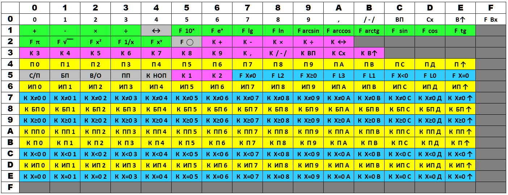

По вертикали указана первая шестнадцатеричная цифра кода, по горизонтали —
вторая.

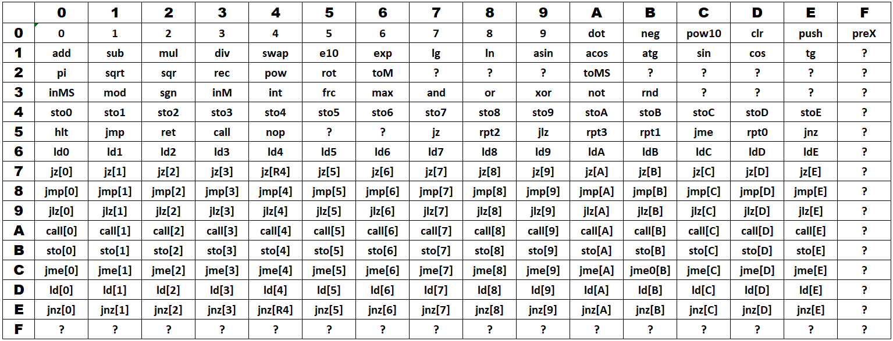

| Клавиша калькулятора | Мнемоника | Смысл мнемоники |
| --- | --- | --- |
| `БП` | `JMP` | безусловный переход, Jump |
| `ПП` | `CALL` | вызов подпрограммы, Call |
| `В/О` | `RET` | возврат, Return |
| `С/П` | `HLT` | останов, Halt |
| `П→X` | `STO` | запись, Store |
| `X←П` | `LD` | загрузка, Load |
| `X≠0` | `JZ` | переход при нуле |
| `X≥0` | `JLZ` | переход при отрицательном X |
| `X<0` | `JME` | переход при X больше или равном нулю |
| `X=0` | `JNZ` | переход при ненулевом X |

## Краткий справочник

### Общие команды

| Команда | Назначение |
| --- | --- |
| `ver` | Версия и дата сборки прошивки. |
| `date` | Чтение и установка даты и времени RTC. |
| `help` | Актуальный список команд из самой прошивки. |
| `history` | История строк интерактивного терминала. |

### Программная память

| Команда | Назначение |
| --- | --- |
| `list` | Вертикальная hex-таблица программной памяти. |
| `dump` | Последовательность hex-кодов программы. |
| `pub` | Листинг в журнальном формате. |
| `lasm` | Дизассемблированный листинг. |
| `isa` | Таблица ассемблерных мнемоник. |
| `asm` | Сборка мнемоник в программную память. |
| `ins` | Вставка одного opcode со сдвигом программы. |
| `hin` | Запись строки hex-байтов. |
| `hout` | Вывод программы в виде строк для `hin`. |
| `clr` | Очистка программной памяти с подтверждением. |
| `set$` | Совместимая служебная форма hex-записи. |

### Состояние калькулятора и клавиатура

| Команда | Назначение |
| --- | --- |
| `reg` | Регистры памяти R0…RE. |
| `stk` | Стек X, Y, Z, T, X1 и адрес исполнения. |
| `poke` | Запись числа в X, Y, Z или T. |
| `1302` | Регистр R микросхемы К145ИК1302. |
| `ring` | Активное кольцо памяти M. |
| `R…=` | Запись числа в R0…RE, а в расширенном режиме и RF. |
| `kbd` | Нажатие физической клавиши по scan-code. |
| `cmd` | Нажатие клавиш, соответствующих opcode МК-61. |
| `run` | Запуск программы или открытие сохраненного файла. |
| `disa` | Переключение дизассемблера на дисплее. |

### Сценарии, индикация и звук

| Команда | Назначение |
| --- | --- |
| `open` | Открытие или запуск файла из хранилища. |
| `if` | Выполнение следующей команды по условию. |
| `led` | Асинхронная последовательность состояний светодиода. |
| `beep` | Асинхронная последовательность звуков и пауз. |

### Хранилище

| Команда | Назначение |
| --- | --- |
| `save` | Сохранение программы M61 в слот или по пути, с подтверждением. |
| `load` | Загрузка программы M61 из слота или по пути. |
| `pwd` | Полный путь текущего каталога. |
| `cd` | Смена текущего каталога. |
| `ls`, `dir` | Просмотр каталога или одной записи. |
| `mkdir` | Создание каталога; `-p` создаёт весь путь. |
| `mv` | Перемещение или переименование файла/каталога. |
| `rm`, `del` | Удаление файла; `-r` удаляет дерево. |
| `rmdir` | Удаление пустого каталога. |
| `df` | Физическая ёмкость, квота узлов и размер FAT12-кластера. |
| `fsget`, `fsput` | Машинная передача файлов для `tools/mkc.sh`. |
| `smap` | Карта числовых M61-слотов 0…99. |
| `sdir` | Каталог занятых числовых M61-слотов. |
| `snm` | Переименование числового M61-слота. |
| `sdel` | Удаление числового M61-слота с подтверждением. |
| `sera` | Форматирование всего хранилища с подтверждением. |
| `fsls`, `fsrm`, `fsstat` | Синонимы `ls`, `rm`, `df`. |
| `fsclean` | Удаление записей нулевой длины. |
| `vlog` | Журнал трассировки виртуального FAT. |

### Сервис

| Команда | Назначение |
| --- | --- |
| `uscreen` | Запуск ожидания desktop-клиента USB Screen, если возможность включена при сборке. |
| `rst` | Перезагрузка после подтверждения на устройстве. |
| `dfu` | Немедленный переход в USB DFU-загрузчик. |

## Общие команды

### `ver` — версия прошивки

```text
ver
```

Команда печатает модель, дату и время сборки. Строка `sizeof Serial` — служебная
диагностическая информация.

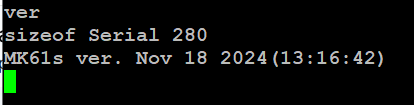

### `date` - дата и время

```text
date
date 2026-07-19 14:35:00
```

Возможные ответы:

```text
2026-07-19 14:35:07
DATE OK
DATE ERROR: expected YYYY-MM-DD HH:MM:SS
```

Без параметра команда печатает дату и время одной строкой. Если пользовательское
время еще не задавалось либо была потеряна резервная область RTC, команда молча
завершается. Параметр сразу задает новое значение: отдельное слово `set` не
используется. Формат строгий, годы допустимы от 2000 до 2099, календарная дата
проверяется с учетом високосных лет. Прошивка хранит введенное местное время и
не пересчитывает часовой пояс. Полное описание приведено в документе
`MK61s-mini-RTC.md`.

### `help` — список команд

```text
help
```

Список строится из того же реестра, по которому прошивка распознает команды,
поэтому `help` — самый надежный способ проверить возможности установленной
версии. В конце также выводятся специальные формы `R<r>=` и `set$`.

### `history` — история ввода

```text
history
```

Команда нумерует строки от старой к новой. Стрелка вверх вызывает предыдущую
строку, стрелка вниз возвращается к более новой или к строке, которую
пользователь редактировал до входа в историю.

## Программная память

### `list` — вертикальная hex-таблица

```text
list
```

Каждая ячейка выводится вместе с адресом шага программы.

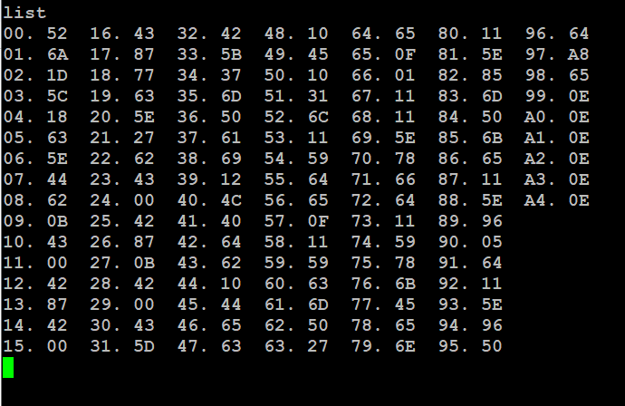

### `dump` — непрерывный hex-листинг

```text
dump
```

Удобен для быстрого копирования или сравнения последовательности opcode.

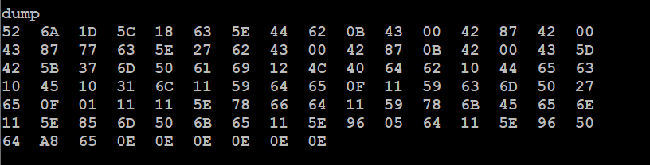

### `pub` — журнальный формат

```text
pub
```

Печатает программу колонками в формате, близком к публикациям программ для
советских программируемых калькуляторов.

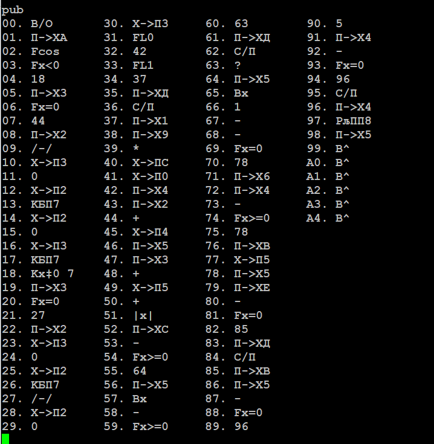

### `lasm` — дизассемблированный листинг

```text
lasm
```

Для каждого шага выводятся адрес, opcode и ассемблерная мнемоника. Второй байт
двухбайтовой команды перехода показывается как ее аргумент.

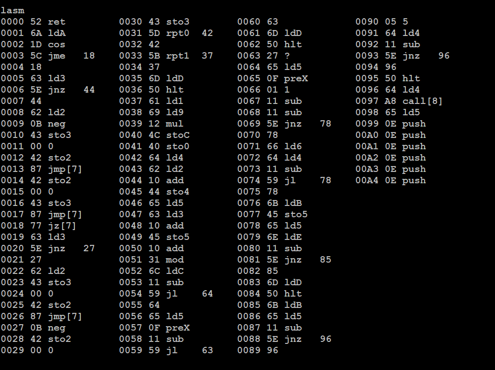

### `isa` — мнемоники ассемблера

```text
isa
```

Печатает поддерживаемые мнемоники в порядке opcode.

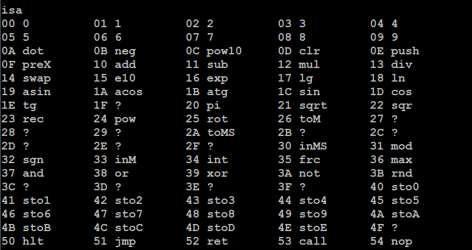

### `asm` — ассемблерный ввод

```text
asm [addr] <mnemonics>
asm 0000 1 2 add hlt
asm 3 4 mul
```

Необязательный `addr` — ровно четыре десятичные цифры начального адреса. Если
адрес не указан, используется адрес трансляции, оставшийся после предыдущей
успешной команды `asm`. Мнемоники разделяются пробелами; завершающий пробел не
нужен.

Строка сначала разбирается целиком и только затем записывается. Неизвестная
мнемоника или выход за границу памяти оставляют прежнюю программу без частичной
записи.

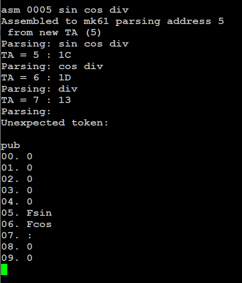

### `ins` — вставка opcode

```text
ins <step> <opcode>
ins 10 20
```

`step` — десятичный номер шага, `opcode` — шестнадцатеричный байт `00`…`FF`.
Команда вставляет байт, сдвигает последующую программу и корректирует адреса
переходов.

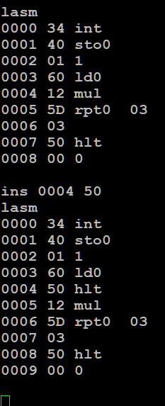

### `hin` — ввод hex-байтов

```text
hin <addr> <hex-bytes>
hin 0000 010203040506
hin 0024 0E01030000000006
```

Адрес должен содержать ровно четыре десятичные цифры. Байты записываются слитно
полными парами hex-цифр. Пробелы внутри строки байтов не допускаются. Запись за
105-й классический шаг автоматически включает расширенную программную память,
если сборка ее поддерживает.

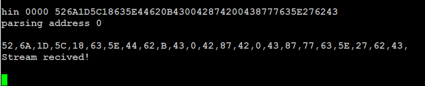

### `hout` — вывод строк для `hin`

```text
hout
```

Вывод разбит на строки с четырехзначным начальным адресом и группами до 24
байтов. Эти строки можно сохранить в текстовый файл или передать другому
пользователю и затем выполнить как команды `hin`.

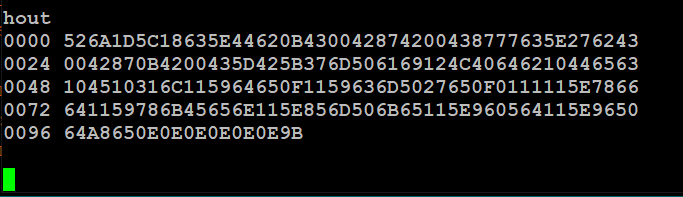

### `clr` — очистка программы

```text
clr
Y
```

После `clr` терминал ожидает отдельную строку `Y` или `y`. Отмена выполняется
отдельной строкой `N` или `n`. Любая другая команда отменяет устаревший запрос
подтверждения и затем обрабатывается как обычная команда.

### `set$` — совместимая форма записи

```text
set$0000 01020304
```

Форма выполняет ту же проверяемую hex-запись, что и `hin`, но адрес примыкает к
имени. Для новых команд и файлов M61 предпочтительнее читаемая форма `hin`.

## Стек, регистры и внутренняя память

### `reg` — регистры R0…RE

```text
reg
```

Показывает все классические регистры памяти в формате индикатора МК-61.

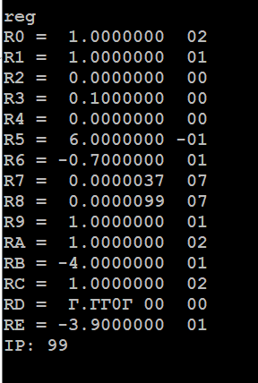

### `stk` — стек

```text
stk
```

Печатает X1, T, Z, Y, X и текущий адрес исполнения `IP`.

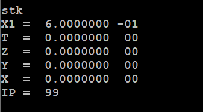

### `poke` — запись в стековый регистр

```text
poke X 1.25e02
poke Y -3.14
```

Допустимы X, Y, Z и T. Значение — конечное десятичное число, представимое
форматом МК-61; порядок должен лежать в диапазоне от −99 до 99.

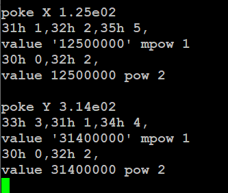

### `R<r>=` — запись регистра памяти

```text
R0= 3.14
RA= -1.25e02
RE= 0
RF= 42
```

Доступны R0…RE. RF разрешен только при включенной расширенной памяти. Значение
проходит ту же проверку представимости, что и аргумент `poke`; произвольные
внутренние BCD-тетрады этой формой записать нельзя.

### `1302` — регистр R К145ИК1302

```text
1302
```

Это низкоуровневый диагностический вывод внутреннего регистра эмулируемой
микросхемы.

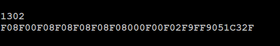

### `ring` — активное кольцо памяти M

```text
ring
```

Печатает активные ячейки кольцевой памяти по эмулируемым микросхемам. Команда
предназначена главным образом для диагностики ядра.

## Клавиатура и запуск

### `kbd` — физический scan-code

```text
kbd <00..27>
kbd 02
```

Аргумент — шестнадцатеричный scan-code физической клавиатуры. Такая команда
зависит от раскладки и нужна для точной имитации конкретной кнопки.

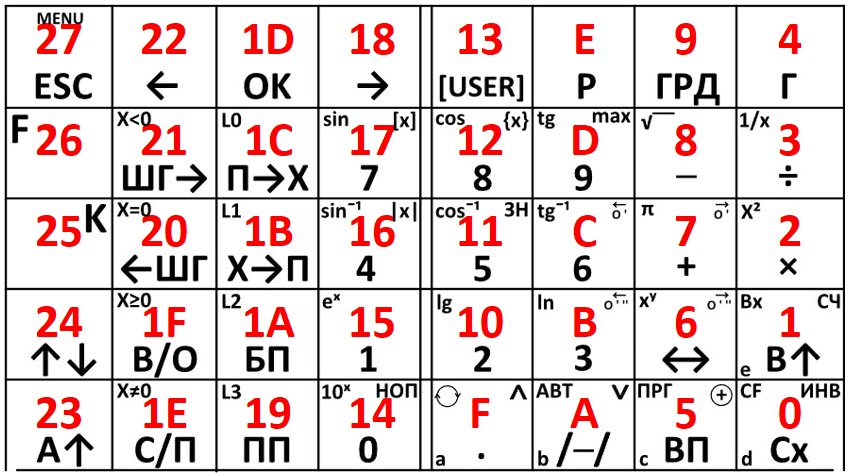

При входе через `kbd` в блокирующее сервисное меню терминал не сможет выполнять
следующие команды, пока пользователь не выйдет из меню на самом устройстве.

### `cmd` — операция по opcode

```text
cmd <00..EF>
cmd 53
```

Прошивка преобразует opcode МК-61 в соответствующую последовательность клавиш.
В отличие от `kbd`, эта форма не зависит от физического scan-code и лучше
подходит для сценариев. Например, `cmd 53` соответствует операции `ПП`.

Старая команда `exec` больше не существует. Если нужен эквивалент нажатия `ПП`,
используйте `cmd 53`.

### `run` — запуск программы или файла

```text
run
run DEMO
run DEMO.m61
```

Без аргумента команда имитирует последовательность `F`, `/-/`, `В/О`, `С/П` и
запускает текущую программу. С именем она работает как `open` и открывает файл
из хранилища.

Только внутри файла M61 допустима форма перехода на метку:

```text
run :loop
```

В интерактивном терминале эта форма возвращает ошибку.

### `disa` — дизассемблер на дисплее

```text
disa
```

Каждый вызов переключает режим верхней строки с дизассемблированной текущей
операцией. Настройка действует не только в режиме ввода программы.

### Пример последовательности действий

```text
poke X 1.25e02
poke Y 3.14e02
kbd 02
stk
```

В X записывается 125, в Y — 314, затем нажимается клавиша умножения и
проверяется результат в стеке. Конкретный scan-code следует сверять со схемой
клавиатуры данной сборки.

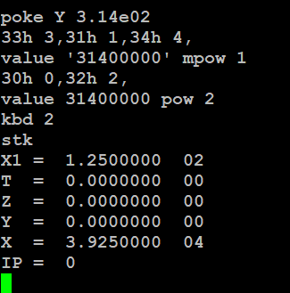

## Условия, светодиод и звук

### `if` — условное выполнение

```text
if <left><op><right> <command>
if x<0 open NEGATIVE.txt
if r0>0 run :loop
if y!=0 beep 1200,80
```

Операнды могут быть числами, стековыми регистрами `x`, `y`, `z`, `t`, `x1` или
регистрами памяти `r0`…`re`; `rf` доступен в расширенном режиме. Поддерживаются
операции `>`, `>=`, `<`, `<=`, `==`, `!=`. При ложном условии остаток строки не
исполняется. При истинном условии он разбирается как обычная команда.

В интерактивном терминале полезны разовые условные действия. В M61 сочетание
`if` и `run :label` образует условные переходы и циклы.

### `led` — последовательность состояний светодиода

```text
led 1
led 0
led 1,500,0,500,1
```

Нечетные элементы — состояния `0` или `1`, четные — длительности в
миллисекундах. Последнее состояние задается без длительности. Допустимо до 16
состояний, каждая пауза — до 65535 мс. Паттерн выполняется асинхронно.

### `beep` — звуковой паттерн

```text
beep 4000,100
beep 4000,100,0,50,2000,200
```

Аргументы идут парами `частота Гц, длительность мс`. Частота `0` задает паузу.
Допустимо до 16 пар; каждое значение — от 0 до 65535. Воспроизведение
асинхронное и использует текущую настройку громкости.

## Файлы и хранилище

Файловая система C5 поддерживает каталоги и типы файлов `M61`, `FOC`, `TBI`,
`TXT`, `STATE.TXT`, `FMK` и `WBMP`. Программы, тексты и шрифты ограничены
1536 байтами, изображения `.wbmp` — 1600 байтами,
basename — 31 байтом корректного UTF-8, глубина дерева — 32 каталогами.
Количество объектов вычисляется из реально измеренной ёмкости flash: например,
для 512 КиБ доступно 192 узла, для штатной W25Q128 на 16 МиБ — 4084. Файл,
каталог и служебное расширение большого каталога занимают по узлу; точные
значения установленного устройства показывает `df`.

Пути могут быть абсолютными (`/Programs/demo.m61`) или относительными текущему
каталогу (`../Examples/demo.m61`). Принимаются `/` и `\`, а также компоненты `.`
и `..`. Весь аргумент с пробелами заключайте в одинарные или двойные кавычки:

```text
cd "/My Programs"
mv 'old name.m61' '../Archive/new name.m61'
```

Расширения и сравнение имён не зависят от регистра в FAT-проекции, включая
основные латинские, греческие и кириллические буквы. Символы FAT
`< > : " / \ | ? *`, управляющие байты, `.`/`..`, завершающие пробел/точка и
зарезервированные DOS-имена не допускаются. Если расширение при чтении опущено,
терминал принимает basename только при единственном совпадении; при нескольких
типах нужно указать расширение.

### `open` — открыть файл

```text
open DEMO.m61
open /Manual/README.txt
open /Pictures/SCHEME.wbmp
open "../FOCAL examples/TEST.foc"
```

Файл открывается или запускается в соответствии с типом. В M61-сценарии
вложенный файл выполняется с последующим возвратом на следующую строку
родительского сценария.

Для `.wbmp` команда открывает тот же полноэкранный просмотрщик, что и
Проводник. `run <path>` является синонимом `open <path>`; `run` без аргумента запускает
текущую программу. Подробности правил M61 приведены в `MK61s-mini-M61.md`.

### `save` — сохранить текущую программу

```text
save 01
save /Programs/DEMO.m61
save "My Programs/DEMO 2"
Y
```

Принимается исторический номер `0`…`99` либо абсолютный/относительный путь M61
с необязательным `.m61`. Чисто цифровой аргумент всегда означает корневой
совместимый слот, независимо от текущего каталога. Перед записью терминал
ожидает отдельную строку `Y`/`y`; `N`/`n` отменяет операцию. Существующий M61
по тому же пути обновляется атомарно. Пустая программа не сохраняется.

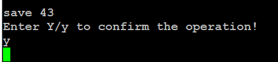

### `load` — загрузить M61

```text
load 01
load ../Programs/DEMO.m61
```

В интерактивном терминале команда загружает программу в память. В M61-сценарии
числовой слот или именованный M61 выполняется как вложенный сценарий и затем
возвращает управление вызывающему файлу.

### `pwd` и `cd` — текущий каталог

```text
pwd
cd /Programs
cd ..
cd
```

`pwd` печатает абсолютный путь. `cd <path>` переходит в существующий каталог,
а `cd` без аргумента возвращает в корень. Текущий путь отображается перед `>` в
каждом приглашении терминала.

### `ls` и `dir` — просмотр каталога

```text
ls
ls /Programs
ls ../README.txt
dir
```

Без аргумента печатаются только непосредственные дети текущего каталога, без
чтения и сортировки всего дерева. Для каталога выводятся строки `d`, для файла
— `f`, размер в байтах и видимое имя с расширением. Аргументом может быть также
один файл. `dir` и `fsls` — синонимы `ls`.

### `mkdir` — создать каталог

```text
mkdir Programs
mkdir -p /Projects/FOCAL/Tests
```

Без `-p` родитель должен существовать. С `-p` недостающие компоненты создаются,
а уже существующий путь считается успехом.

### `mv` — переместить или переименовать

```text
mv DEMO.m61 FINAL.m61
mv FINAL.m61 /Archive
mv /Projects/Old "/Projects/New name"
```

Если назначение — существующий каталог, исходное имя сохраняется. Иначе
последний компонент задаёт новое имя. Тип файла изменять расширением нельзя,
существующее назначение не перезаписывается, каталог нельзя переместить внутрь
собственного поддерева или сделать дерево глубже 32 уровней.

### `rm` и `rmdir` — удалить

```text
rm DEMO.m61
rm -r /Projects/Obsolete
rmdir /Projects/Empty
```

`rm` удаляет файл немедленно. Для каталога требуется явный `rm -r`: дерево
удаляется снизу вверх без рекурсивного расхода стека, после чего печатается
число удалённых объектов. `rmdir` удаляет только пустой каталог. Корень удалить
нельзя. `del` и `fsrm` — синонимы `rm` и также принимают `-r`.

### `df` — ёмкость и квоты

```text
df
```

Печатает измеренную физическую ёмкость SPI NOR, занятые/свободные/всего узлы,
число видимых файлов и каталогов, служебные directory extents, виртуальный
размер FAT12-кластера и объём сектора, зарезервированный под настройки.
`fsstat` — синоним `df`.

### `fsget` и `fsput` — машинная передача файлов

Эти команды являются транспортом двухпанельного менеджера `tools/mkc.sh` и
обычно не вводятся вручную. Они передают произвольный поддерживаемый файл C5,
не меняя текущую программу калькулятора:

```text
fsget "/Programs/demo.m61"
fsput begin "/Programs/demo.m61" 128 3141592653
fsput data 0 00112233AABBCCDD
fsput end
fsput cancel
```

`fsget` отвечает строками `@MKC:GET`, `@MKC:DATA` и `@MKC:END`. Загрузка
начинается `fsput begin`, принимает последовательные HEX-блоки не более 96
байт и завершается `fsput end`; ответы — `@MKC:READY`, `@MKC:ACK` и
`@MKC:DONE`. Ошибка имеет вид `@MKC:ERROR <code>`.

Размер и контрольная сумма проверяются до атомарной записи C5. Контрольная
сумма совпадает с POSIX `cksum`; в неё входит длина файла. Если между блоками
рабочую память занял другой режим, загрузка отклоняется как прерванная. Любая
команда, кроме следующего `fsput`, отменяет незавершённый сеанс. `fsget` и
`fsput` намеренно запрещены внутри M61-сценариев.

Имя назначения обязательно содержит поддерживаемое расширение. Допустимы
`.m61`, `.foc`, `.tbi`, `.txt`, `.state.txt`, `.fmk`, `.wbmp` и старые
псевдонимы `.t1`, `.m2`, `.wbm`; действуют обычные ограничения C5 по имени и
размеру.

### Совместимые числовые слоты M61

Команды ниже работают только с корневыми M61-файлами `0.m61`…`99.m61` и
сохранены для привычного рабочего процесса.

### `smap` — карта слотов 0…99

```text
smap
```

Карта 10×10 показывает `[X]` для существующей программы M61 с числовым именем
и `[ ]` для свободного номера.

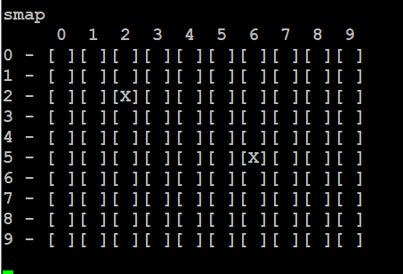

### `sdir` — список числовых слотов

```text
sdir
```

Печатает занятые числовые M61-слоты.

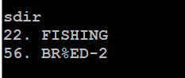

### `snm` — переименовать числовой слот

```text
snm 01 BE-HAPPY
snm 22 FISHING
```

Номер лежит в диапазоне `0`…`99`, новое имя содержит от 1 до 31 байта UTF-8.
Переименование не выполняется, если исходного числового файла нет, имя
недопустимо или видимое FAT-имя уже занято. Для перемещения в каталог
используйте `mv`.

В ранней версии руководства в примерах ошибочно было написано `sname`.
Зарегистрированное имя команды — `snm`.

### `sdel` — удалить числовой слот

```text
sdel 22
Y
```

Команда проверяет существование M61-файла с указанным числовым именем и ждет
отдельную строку `Y`/`y`. `N`/`n` отменяет удаление.

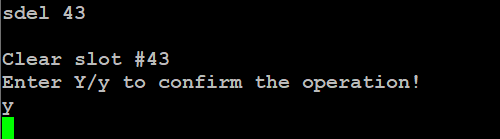

### `sera` — форматировать хранилище

```text
sera
Y
```

Команда форматирует всю C5, а не только числовые M61-слоты. Будут удалены все
файлы и каталоги; зарезервированный журнал настроек сохраняет свою отдельную
область. Требуется отдельное подтверждение `Y`/`y`, отмена — `N`/`n`.

### `fsclean` — удалить пустые записи

```text
fsclean
```

Немедленно удаляет все файлы нулевой длины во всём дереве и печатает их
количество. Полезно после оборванного или некорректного импорта через
виртуальный USB-диск.

### `vlog` — трассировка виртуального FAT

```text
vlog
```

Выводит накопленный журнал USB/VFAT только в сборке с
`MK61_VFAT_TRACE`. В обычной сборке сообщает, что трассировка пуста.

## Сервисные команды

### `uscreen` — внешний USB-экран

```text
uscreen
```

В сборке с `MK61_ENABLE_USB_SCREEN=1` команда переводит firmware в ожидание
handshake с приложением MK61 USB Screen. Desktop-клиент отправляет её
автоматически сразу после открытия CDC-порта, поэтому выбирать пункт меню на
устройстве не требуется. Обычный terminal обслуживается из общего idle-loop:
команда принимается и тогда, когда ввод ждёт редактор FOCAL/TinyBASIC или другой
foreground-интерфейс. До успешного `ATTACH` физический экран остаётся включённым.

Команда не принимает аргументов и идемпотентна. В сборке с выключенным USB
Screen она отсутствует в `help`. Полное описание handshake, приложения и выхода
находится в `MK61s-mini-USB-Screen.md`.

### `rst` — перезагрузка

```text
rst
```

Подтверждение выполняется на дисплее и клавиатуре самого устройства. После
подтверждения микроконтроллер перезагружается, а USB-порт временно исчезает.

### `dfu` — загрузчик DFU

```text
dfu
```

Команда без дополнительного терминального подтверждения переводит устройство в
режим USB Device Firmware Upgrade. Текущая терминальная сессия сразу
заканчивается. Перед вводом убедитесь, что переход действительно нужен.

## Команды в файлах M61

Строки сценария M61 используют тот же синтаксис, но выполняются с ограниченными
правами. Разрешены:

- управление: `run`, `open`, `load`, `if`;
- программа: `hin`, `set$`, `asm`, `ins`, `list`, `dump`, `pub`, `lasm`,
  `isa`, `hout`;
- калькулятор: `poke`, `R<r>=`, `reg`, `stk`, `1302`, `ring`, `kbd`, `cmd`;
- безопасные действия: `ver`, `led`, `beep`.

Метки `:name` и команда `run :name` существуют только внутри M61. Новая команда
терминала автоматически не получает права сценария. В частности, `date`,
`history`, `uscreen`, команды удаления, форматирование, перезагрузка и DFU в
M61 запрещены.

Полный синтаксис, вложенные файлы, метки и ограничения описаны в
`MK61s-mini-M61.md`.

## Подтверждения и осторожность

Терминальное подтверждение отдельной строкой `Y`/`N` используют:

- `clr`;
- `save`;
- `sdel`;
- `sera`.

`rst` подтверждается на самом устройстве. `rm`/`del`/`fsrm`, в том числе
рекурсивный `-r`, а также `mv`, `rmdir`, `fsclean`, `snm` и `dfu` выполняются
без терминального запроса. Для опасных команд проверяйте полный путь и тип файла
до нажатия Enter.

## Что изменилось относительно старой инструкции

- Команда часов `rtc [set ...]` заменена на `date [...]`; при неустановленном
  времени чтение завершается без сообщения.
- Добавлены `help`, `history`, `ring`, `cmd`, `open`, `if`, `led`, `beep`,
  именованные `save`/`load`, дерево C5 и команды `pwd`, `cd`, `ls`,
  `mkdir`, `mv`, `rm -r`, `rmdir`, `df`, `fsclean` и `vlog`.
- `run` теперь умеет открывать файл, а в M61 — переходить на метку.
- `snm` принимает имя длиной до 31 байта UTF-8; ошибочная форма `sname` удалена
  из примеров.
- Первый аргумент `ins` — десятичный номер шага, второй — hex-opcode.
- `asm` больше не требует завершающего пробела и не изменяет память при ошибке
  разбора.
- Устаревшая команда `exec` удалена; эквивалент клавиши `ПП` — `cmd 53`.
- Подтверждение можно отменить отдельной строкой `N` или `n`.

Для установленной прошивки окончательным источником списка команд остается
команда `help`.
