# Проект «Эмулятор микрокалькулятора Электроника МК-61s mini»

https://github.com/UN7FGO/MK61S_MINI

# Руководство по работе с терминалом

Версия инструкции: 02.08.2026

Терминал дает доступ к программной памяти, стеку и регистрам МК-61, внутреннему
хранилищу, клавиатуре устройства, сервисным функциям и часам RTC. Настоящее
руководство перенесено из Word-документа и приведено в соответствие с текущей
прошивкой.

## Подключение

Подключите MK61s mini к компьютеру по USB и откройте появившийся виртуальный
последовательный порт в PuTTY, Tera Term, Arduino IDE Serial Monitor, `screen`,
`minicom` или другой терминальной программе.

Рекомендуемые параметры:

- скорость 115200 бод;
- 8 бит данных, без контроля четности, 1 стоп-бит;
- без аппаратного и программного управления потоком;
- окончание строки CR, LF или CRLF;
- локальное эхо выключено: устройство само возвращает введенные символы;
- окно не меньше 80 столбцов и 40 строк;
- для специального символа индикатора полезна кодовая страница Windows-1251.

При USB CDC значение скорости фактически не задает скорость USB-передачи, но
115200 соответствует настройке прошивки и подходит для всех терминальных
программ. В режиме `USB-диск` последовательный терминал остановлен. Чтобы снова
работать с командами, выйдите из режима USB-диска клавишей `ESC` на устройстве.

После подключения прошивка печатает версию и приглашение:

```text
MK61s mini ver. Jul 19 2026(12:34:56)
/>
```

Перед `>` показывается текущий каталог C5. После запуска это корень `/`; после
`cd /Programs` приглашение станет `/Programs>`. Если полный путь не помещается
во внутренний буфер приглашения, вместо него показывается `...>`; `pwd`
по-прежнему позволяет запросить путь явно.

Введите `help` и завершите строку клавишей Enter. Команды и английские имена
регистров вводятся ASCII-символами. Имя команды пишется в нижнем регистре;
специальная запись регистра начинается с заглавной `R`.

## Редактор строки и история

Терминал принимает CR, LF и пары CRLF/LFCR. В ANSI-совместимых клиентах,
включая PuTTY и Tera Term, стрелки влево и вправо перемещают курсор,
`Backspace` стирает символ перед ним, а `Delete` — символ под ним. Ввод в
середине строки работает в режиме вставки; `Home` и `End` переходят к началу и
концу строки. Дополнительно поддерживаются стандартные сочетания `Ctrl+A`,
`Ctrl+B`, `Ctrl+D`, `Ctrl+E` и `Ctrl+F`.

Стрелки вверх и вниз листают историю. Команда `history` печатает сохраненные
строки. При возврате из истории восстанавливаются как незавершенная строка,
так и положение курсора в ней.

Хранятся до 8 последних неповторяющихся подряд команд общим объемом до 256
байт. Максимальная полезная длина одной строки — 239 символов. Переполненная
строка целиком отбрасывается и не исполняется.

## Как устроена память МК-61

Программируемые калькуляторы семейства МК-61 имеют раздельные память программы
и память данных. Программная память состоит из байтовых кодов операций, а стек
и регистры памяти хранят числа в собственном десятичном формате калькулятора.
Поэтому команды для программы, стека и регистров разделены.

Для программной памяти доступны как шестнадцатеричные коды, так и ассемблерные
мнемоники. Условные переходы оригинального калькулятора выполняют переход при
невыполнении написанного на клавише условия. Из-за этого названия некоторых
ассемблерных переходов выглядят зеркально по отношению к надписям на клавишах.

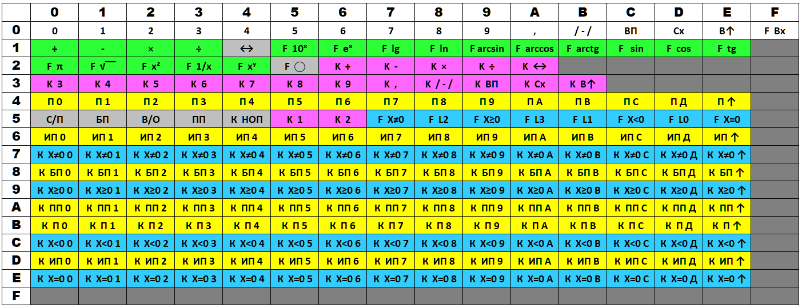

По вертикали указана первая шестнадцатеричная цифра кода, по горизонтали —
вторая.

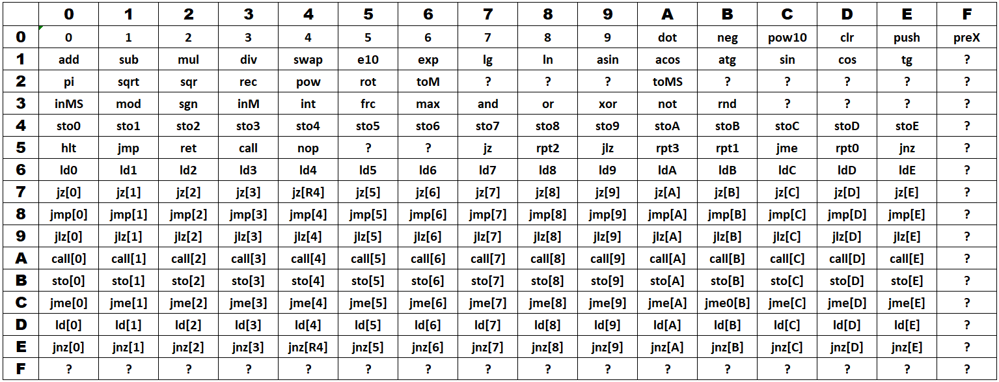

| Клавиша калькулятора | Мнемоника | Смысл мнемоники |
| --- | --- | --- |
| `БП` | `JMP` | безусловный переход, Jump |
| `ПП` | `CALL` | вызов подпрограммы, Call |
| `В/О` | `RET` | возврат, Return |
| `С/П` | `HLT` | останов, Halt |
| `П→X` | `STO` | запись, Store |
| `X←П` | `LD` | загрузка, Load |
| `X≠0` | `JZ` | переход при нуле |
| `X≥0` | `JLZ` | переход при отрицательном X |
| `X<0` | `JME` | переход при X больше или равном нулю |
| `X=0` | `JNZ` | переход при ненулевом X |

## Краткий справочник

### Общие команды

| Команда | Назначение |
| --- | --- |
| `ver` | Версия и дата сборки прошивки. |
| `date` | Чтение и установка даты и времени RTC. |
| `help` | Актуальный список команд из самой прошивки. |
| `history` | История строк интерактивного терминала. |

### Программная память

| Команда | Назначение |
| --- | --- |
| `list` | Вертикальная hex-таблица программной памяти. |
| `dump` | Последовательность hex-кодов программы. |
| `pub` | Листинг в журнальном формате. |
| `lasm` | Дизассемблированный листинг. |
| `isa` | Таблица ассемблерных мнемоник. |
| `asm` | Сборка мнемоник в программную память. |
| `ins` | Вставка одного opcode со сдвигом программы. |
| `hin` | Запись строки hex-байтов. |
| `hout` | Вывод программы в виде строк для `hin`. |
| `clr` | Очистка программной памяти с подтверждением. |
| `set$` | Совместимая служебная форма hex-записи. |

### Состояние калькулятора и клавиатура

| Команда | Назначение |
| --- | --- |
| `reg` | Регистры памяти R0…RE. |
| `stk` | Стек X, Y, Z, T, X1 и адрес исполнения. |
| `poke` | Запись числа в X, Y, Z или T. |
| `1302` | Регистр R микросхемы К145ИК1302. |
| `ring` | Активное кольцо памяти M. |
| `R…=` | Запись числа в R0…RE, а в расширенном режиме и RF. |
| `kbd` | Нажатие физической клавиши по scan-code. |
| `cmd` | Нажатие клавиш, соответствующих opcode МК-61. |
| `reinit` | Чистая инициализация калькулятора без перезагрузки устройства. |
| `run` | Запуск программы или открытие сохраненного файла. |
| `disa` | Переключение дизассемблера на дисплее. |

### Сценарии, индикация и звук

| Команда | Назначение |
| --- | --- |
| `open` | Открытие или запуск файла из хранилища. |
| `if` | Выполнение следующей команды по условию. |
| `print` | Вывод строки, байтовых escapes и регистров на текущий экран; прежде всего для M61. |
| `wait` | Неблокирующая пауза M61-сценария в миллисекундах. |
| `ret` | Возврат из M61-сценария или обработчика ловушки. |
| `bind` | Привязка введённого opcode к обработчику M61. |
| `led` | Асинхронная последовательность состояний светодиода. |
| `beep` | Асинхронная последовательность звуков и пауз. |

### Хранилище

| Команда | Назначение |
| --- | --- |
| `save` | Сохранение программы M61 в слот или по пути, с подтверждением. |
| `load` | Загрузка программы M61 из слота или по пути. |
| `pwd` | Полный путь текущего каталога. |
| `cd` | Смена текущего каталога. |
| `ls`, `dir` | Просмотр каталога или одной записи. |
| `mkdir` | Создание каталога; `-p` создаёт весь путь. |
| `mv` | Перемещение или переименование файла/каталога. |
| `rm`, `del` | Удаление файла; `-r` удаляет дерево. |
| `rmdir` | Удаление пустого каталога. |
| `df` | Физическая ёмкость, квота узлов и размер FAT12-кластера. |
| `fsget`, `fsput` | Машинная передача файлов для `tools/mkc.cmd`. |
| `smap` | Карта числовых M61-слотов 0…99. |
| `sdir` | Каталог занятых числовых M61-слотов. |
| `snm` | Переименование числового M61-слота. |
| `sdel` | Удаление числового M61-слота с подтверждением. |
| `sera` | Форматирование всего хранилища с подтверждением. |
| `fsls`, `fsrm`, `fsstat` | Синонимы `ls`, `rm`, `df`. |
| `fsclean` | Удаление записей нулевой длины. |
| `vlog` | Журнал трассировки виртуального FAT. |

### Сервис

| Команда | Назначение |
| --- | --- |
| `prof` | DWT-профиль времени ядра, дисплея, USB Screen, C5 и ZX0; снимок можно сохранить в текстовый файл. |
| `crash` | Просмотр, сохранение и очистка сохранённого аппаратного fault dump. |
| `wdog` | Состояние independent watchdog, причина последнего reset и retained breadcrumbs. |
| `mpu` | Состояние аппаратной защиты нулевого адреса, границы stack/heap и исполнения из SRAM. |
| `uscreen` | Запуск ожидания desktop-клиента USB Screen, если возможность включена при сборке. |
| `rst` | Перезагрузка после подтверждения на устройстве. |
| `dfu` | Немедленный переход в USB DFU-загрузчик. |

## Общие команды

### `ver` — версия прошивки

```text
ver
```

Команда печатает модель, дату и время сборки. Строка `sizeof Serial` — служебная
диагностическая информация.

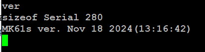

### `date` - дата и время

```text
date
date 2026-07-19 14:35:00
```

Возможные ответы:

```text
2026-07-19 14:35:07
Set the date.
DATE OK
DATE ERROR: expected YYYY-MM-DD HH:MM:SS
```

Без параметра команда печатает дату и время одной строкой. Если пользовательское
время ещё не задавалось либо была потеряна резервная область RTC, следующей
строкой выводится предупреждение `Set the date.` Параметр сразу задаёт новое
значение: отдельное слово `set` не используется. Формат строгий, годы допустимы
от 2000 до 2099, календарная дата проверяется с учётом високосных лет. Прошивка
хранит введённое местное время и не пересчитывает часовой пояс. Полное описание
приведено в документе `MK61s-mini-RTC.md`.

### `help` — список команд

```text
help
```

Список строится из того же реестра, по которому прошивка распознает команды,
поэтому `help` — самый надежный способ проверить возможности установленной
версии. В конце также выводятся специальные формы `R<r>=` и `set$`.

### `history` — история ввода

```text
history
```

Команда нумерует строки от старой к новой. Стрелка вверх вызывает предыдущую
строку, стрелка вниз возвращается к более новой или к строке, которую
пользователь редактировал до входа в историю.

## Программная память

### `list` — вертикальная hex-таблица

```text
list
```

Каждая ячейка выводится вместе с адресом шага программы.

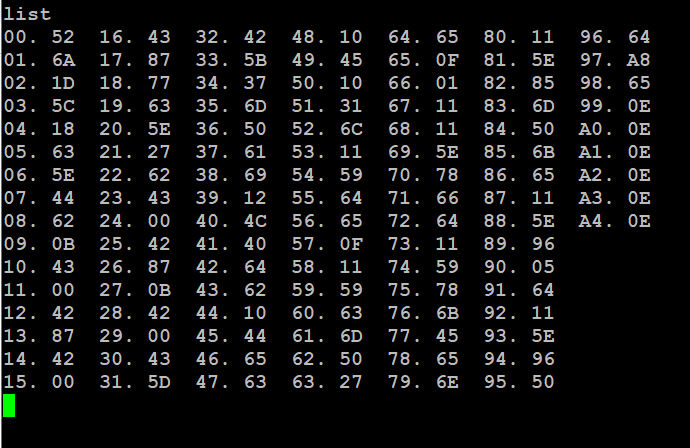

### `dump` — непрерывный hex-листинг

```text
dump
```

Удобен для быстрого копирования или сравнения последовательности opcode.

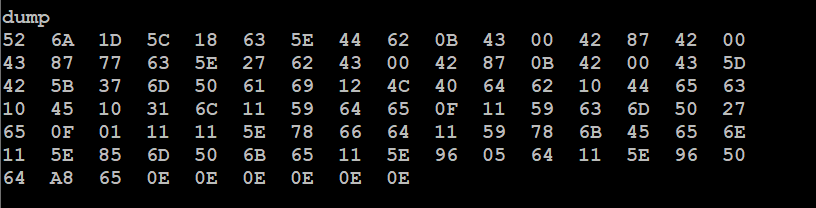

### `pub` — журнальный формат

```text
pub
```

Печатает программу колонками в формате, близком к публикациям программ для
советских программируемых калькуляторов.

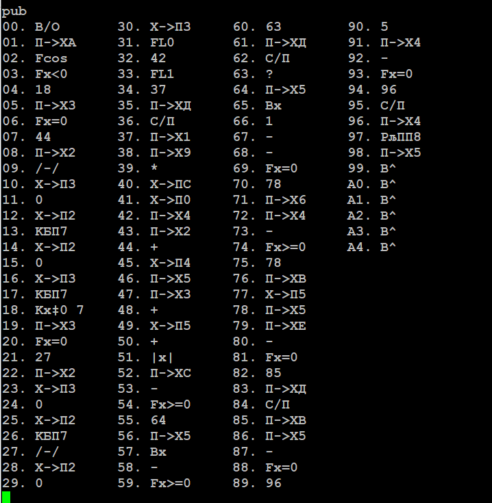

### `lasm` — дизассемблированный листинг

```text
lasm
```

Для каждого шага выводятся адрес, opcode и ассемблерная мнемоника. Второй байт
двухбайтовой команды перехода показывается как ее аргумент.

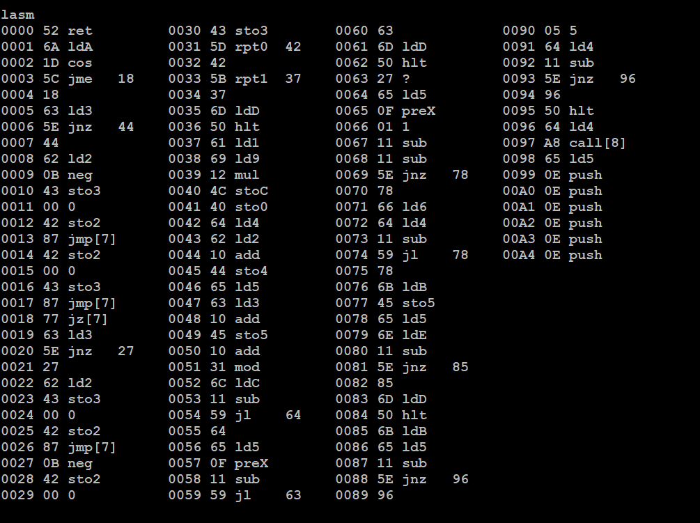

### `isa` — мнемоники ассемблера

```text
isa
```

Печатает поддерживаемые мнемоники в порядке opcode.

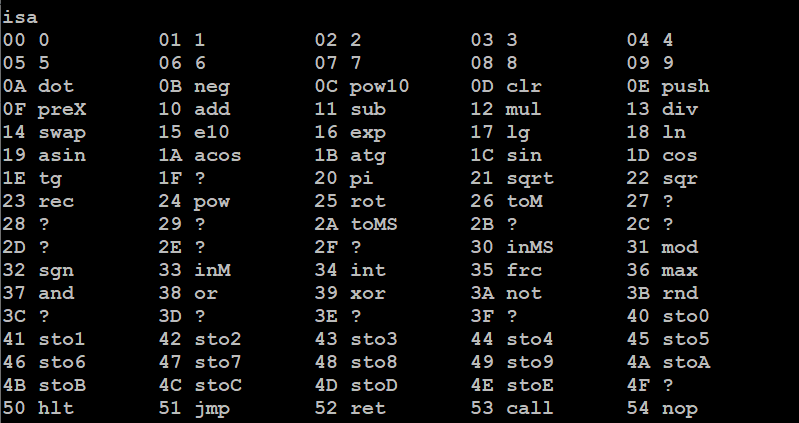

### `asm` — ассемблерный ввод

```text
asm [addr] <mnemonics>
asm 0000 1 2 add hlt
asm 3 4 mul
```

Необязательный `addr` — ровно четыре десятичные цифры начального адреса. Если
адрес не указан, используется адрес трансляции, оставшийся после предыдущей
успешной команды `asm`. Мнемоники разделяются пробелами; завершающий пробел не
нужен.

Строка сначала разбирается целиком и только затем записывается. Неизвестная
мнемоника или выход за границу памяти оставляют прежнюю программу без частичной
записи.

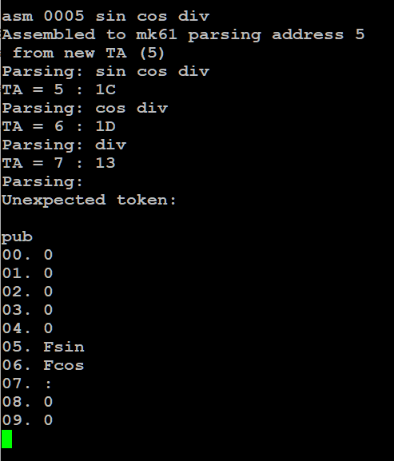

### `ins` — вставка opcode

```text
ins <step> <opcode>
ins 10 20
```

`step` — десятичный номер шага, `opcode` — шестнадцатеричный байт `00`…`FF`.
Команда вставляет байт, сдвигает последующую программу и корректирует адреса
переходов.

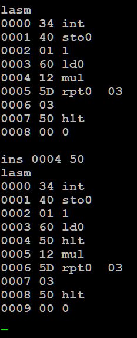

### `hin` — ввод hex-байтов

```text
hin <addr> <hex-bytes>
hin 0000 010203040506
hin 0024 0E01030000000006
```

Адрес должен содержать ровно четыре десятичные цифры. Байты записываются слитно
полными парами hex-цифр. Пробелы внутри строки байтов не допускаются. Запись за
105-й классический шаг автоматически включает расширенную программную память,
если сборка ее поддерживает.

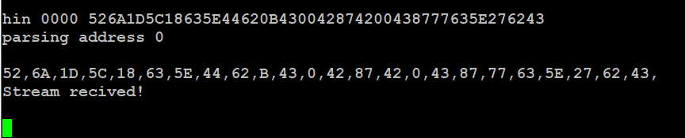

### `hout` — вывод строк для `hin`

```text
hout
```

Вывод разбит на строки с четырехзначным начальным адресом и группами до 24
байтов. Эти строки можно сохранить в текстовый файл или передать другому
пользователю и затем выполнить как команды `hin`.

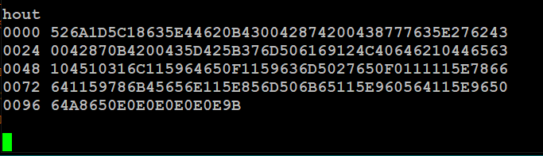

### `clr` — очистка программы

```text
clr
Y
```

После `clr` терминал ожидает отдельную строку `Y` или `y`. Отмена выполняется
отдельной строкой `N` или `n`. Любая другая команда отменяет устаревший запрос
подтверждения и затем обрабатывается как обычная команда.

### `set$` — совместимая форма записи

```text
set$0000 01020304
```

Форма выполняет ту же проверяемую hex-запись, что и `hin`, но адрес примыкает к
имени. Для новых команд и файлов M61 предпочтительнее читаемая форма `hin`.

## Стек, регистры и внутренняя память

### `reg` — регистры R0…RE

```text
reg
```

Показывает все классические регистры памяти в формате индикатора МК-61.

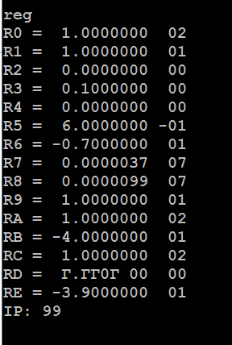

### `stk` — стек

```text
stk
```

Печатает X1, T, Z, Y, X и текущий адрес исполнения `IP`.

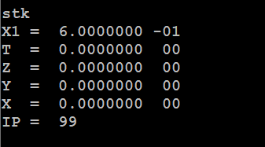

### `poke` — запись в стековый регистр

```text
poke X 1.25e02
poke Y -3.14
```

Допустимы X, Y, Z и T. Значение — конечное десятичное число, представимое
форматом МК-61; порядок должен лежать в диапазоне от −99 до 99.

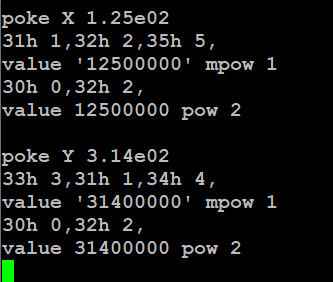

### `R<r>=` — запись регистра памяти

```text
R0= 3.14
RA= -1.25e02
RE= 0
RF= 42
```

Доступны R0…RE. RF разрешен только при включенной расширенной памяти. Значение
проходит ту же проверку представимости, что и аргумент `poke`; произвольные
внутренние BCD-тетрады этой формой записать нельзя.

### `1302` — регистр R К145ИК1302

```text
1302
```

Это низкоуровневый диагностический вывод внутреннего регистра эмулируемой
микросхемы.

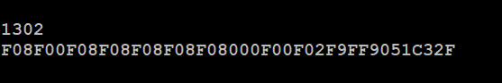

### `ring` — активное кольцо памяти M

```text
ring
```

Печатает активные ячейки кольцевой памяти по эмулируемым микросхемам. Команда
предназначена главным образом для диагностики ядра.

## Клавиатура и запуск

### `kbd` — физический scan-code

```text
kbd <00..27>
kbd 02
```

Аргумент — шестнадцатеричный scan-code физической клавиатуры. Такая команда
зависит от раскладки и нужна для точной имитации конкретной кнопки.

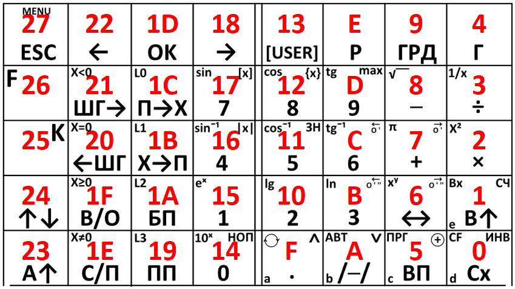

При входе через `kbd` в блокирующее сервисное меню терминал не сможет выполнять
следующие команды, пока пользователь не выйдет из меню на самом устройстве.

### `cmd` — операция по opcode

```text
cmd <00..EF>
cmd 53
```

Прошивка преобразует opcode МК-61 в соответствующую последовательность клавиш.
В отличие от `kbd`, эта форма не зависит от физического scan-code и лучше
подходит для сценариев. Например, `cmd 53` соответствует операции `ПП`.

Старая команда `exec` больше не существует. Если нужен эквивалент нажатия `ПП`,
используйте `cmd 53`.

### `reinit` — чистое состояние калькулятора

```text
reinit
```

Команда без подтверждения очищает программную память, стек, регистры,
префиксы, ошибку, адрес исполнения и расширенное состояние МК-61. Текущий
режим углов Р/Г/ГРД сохраняется. Активный M61-сценарий отменяется вместе с его
ловушками `trap` и привязками `bind`.

Внутри обычного M61 команда продолжает тот же сценарий со следующей строки,
но также снимает его активные `trap` и `bind`. В обработчике `trap` она
запрещена. Не путайте её с `clr`, который очищает только программную память, и
с `rst`, который перезагружает микроконтроллер и временно отключает USB.

Чтобы снять активные `trap` и `bind`, не очищая состояние калькулятора,
удерживайте физическую клавишу `Cx`. Короткое нажатие `Cx` остаётся обычной
операцией калькулятора.

### `run` — запуск программы или файла

```text
run
run DEMO
run DEMO.m61
```

Без аргумента команда имитирует последовательность `F`, `/-/`, `В/О`, `С/П` и
запускает текущую программу. С именем она работает как `open` и открывает файл
из хранилища.

Только внутри файла M61 допустима форма перехода на метку:

```text
run :loop
```

В интерактивном терминале эта форма возвращает ошибку.

### `print` — вывод на экран из M61

```text
print "TEST"
print "X={X}, X1={X1}, X2={X2}, RF={RF}\r\n"
print "\x1B[3;5H*"
print "\x1B[2K\rstatus"
print "\xFF"
```

Команда пишет в текущий экранный буфер, не очищает его и не добавляет перевод
строки. Обычный текст заменяет только свои ячейки. Она понимает `\\`, `\"`,
`\r`, `\n`, `\t`, `\b`, `\xHH`, подстановки стека `X/Y/Z/T/X1/X2` и памяти
`R0`...`RF` (также короткие `0`...`F`). `RF` требует расширенного режима.
Суффикс `:m` выводит первую цифру нормализованной мантиссы, а `:e` — модуль
десятичного порядка без ведущего нуля. Для `X2` эти форматы неприменимы.

Разряды регистров выводятся через ту же таблицу 16 состояний, что и индикатор
МК-61:

| Тетрада | Знак на экране |
| --- | --- |
| `0`...`9` | `O`, `1`...`9` (`O` — экранный знак нуля) |
| `A` | `-` |
| `B` | `L` |
| `C` | `C` |
| `D` | `Г` |
| `E` | `E` |
| `F` | пробел |

Поэтому подстановка не теряет возникающие в разрядах `L`, `C`, `Г`, `E`,
минус и пробел. `{X}`, `{Y}`, `{Z}`, `{T}`, `{X1}` и регистры памяти получают
фиксированное регистровое представление. `{X2}` копирует непосредственно
текущие 12 разрядов индикатора и положение запятой; именно её следует
использовать для вывода снятого кадра программы МК-61.

Прошивка обрабатывает полезный монохромный поднабор ANSI: `A/B/C/D/E/F`, `G`,
`H/f`, `J/K`, `s/u` и `ESC 7`/`ESC 8`; SGR не меняет монохромный экран.
Координаты ограничены реальным размером активного дисплея. `\xHH`, включая
`\x00` и `\xFF`, передаёт один экранный код без перекодирования. В
интерактивном терминале команда тоже доступна, но основной сценарий
использования — `.m61`.

Первый успешный `print` из `.m61` удерживает экран за сценарием до его
завершения: промежуточная индикация работающего ядра подавляется, а выбранные
кадры можно выводить из `trap`. Интерактивный `print` экран не захватывает.

`wait <1..60000>` доступна только внутри `.m61` и асинхронно приостанавливает
сценарий на указанное число миллисекунд. Внутри обработчика `trap` сохранённый
контекст калькулятора остаётся приостановленным до `ret`.

### `ret` и `trap` — возврат и перехват M61

`ret` допустим только в `.m61`: он возвращает из локальной метки, обработчика
`trap` или `bind`, из вложенного сценария либо завершает корневой сценарий.
Если к этому моменту в корневом сценарии активированы ловушки или привязки,
прошивка оставляет наблюдатель включённым. ESC снимает его. Объявление

```text
trap 105 run :message
```

останавливает программу перед opcode шага 105 и передаёт управление метке.
Краткое описание языка находится в руководстве M61
(`MK61s-mini-M61.md`), а полный путь ловушки по коду, правила сохранения
контекста и ограничения обработчика — в документе
«Команда `trap` в M61: семантика и реализация»
(`MK61s-mini-M61-Trap.md`).

Привязка

```text
bind AE run :message
```

перехватывает введённый с клавиатуры opcode `AE`, поглощает исходную операцию и
вызывает метку. Команды программы с тем же opcode не перехватываются.
Обработчик `bind` обязан завершиться `ret`; одновременно допускается до восьми
разных opcode. Полные правила приведены в руководстве M61.

### `disa` — дизассемблер на дисплее

```text
disa
```

Каждый вызов переключает режим верхней строки с дизассемблированной текущей
операцией. Настройка действует не только в режиме ввода программы.

### Пример последовательности действий

```text
poke X 1.25e02
poke Y 3.14e02
kbd 02
stk
```

В X записывается 125, в Y — 314, затем нажимается клавиша умножения и
проверяется результат в стеке. Конкретный scan-code следует сверять со схемой
клавиатуры данной сборки.

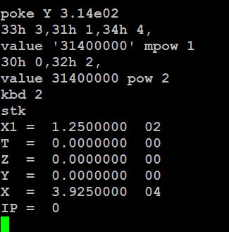

## Условия, светодиод и звук

### `if` — условное выполнение

```text
if <left><op><right> <command>
if x<0 open NEGATIVE.txt
if r0>0 run :loop
if y!=0 beep 1200,80
```

Операнды могут быть числами, стековыми регистрами `x`, `y`, `z`, `t`, `x1` или
регистрами памяти `r0`…`re`; `rf` доступен в расширенном режиме. Поддерживаются
операции `>`, `>=`, `<`, `<=`, `==`, `!=`. При ложном условии остаток строки не
исполняется. При истинном условии он разбирается как обычная команда.

В интерактивном терминале полезны разовые условные действия. В M61 сочетание
`if` и `run :label` образуют условные переходы и циклы. Внутри обработчика
`trap` команда `run :label` является локальным вызовом: `ret` возвращает на
следующую строку обработчика.

### `led` — последовательность состояний светодиода

```text
led 1
led 0
led 1,500,0,500,1
```

Нечетные элементы — состояния `0` или `1`, четные — длительности в
миллисекундах. Последнее состояние задается без длительности. Допустимо до 16
состояний, каждая пауза — до 65535 мс. Паттерн выполняется асинхронно.

### `beep` — звуковой паттерн

```text
beep 4000,100
beep 4000,100,0,50,2000,200
```

Аргументы идут парами `частота Гц, длительность мс`. Частота `0` задает паузу.
Допустимо до 16 пар; каждое значение — от 0 до 65535. Воспроизведение
асинхронное и использует текущую настройку громкости.

## Файлы и хранилище

Файловая система C5 поддерживает каталоги и типы файлов `M61`, `FOC`, `TBI`,
`TXT`, `STATE.TXT`, `FMK`, `WBMP`, `CH8` и `APP`. Программы, тексты и шрифты
ограничены 1536 байтами, изображения `.wbmp` - 1600 байтами, ROM `.ch8` -
3584 байтами, исполняемые контейнеры `.app` - 20 544 байтами. Basename занимает до 31 байта корректного
UTF-8, глубина дерева — до 32 каталогов. Количество объектов вычисляется из
реально измеренной ёмкости flash: например, для 512 КиБ доступно 192 узла,
для штатной W25Q128 на 16 МиБ — 4084. Обычный файл и каталог занимают по узлу;
большой APP, ROM и расширение большого каталога дополнительно расходуют
служебные узлы. Точные значения установленного устройства показывает `df`.

Пути могут быть абсолютными (`/Programs/demo.m61`) или относительными текущему
каталогу (`../Examples/demo.m61`). Принимаются `/` и `\`, а также компоненты `.`
и `..`. Весь аргумент с пробелами заключайте в одинарные или двойные кавычки:

```text
cd "/My Programs"
mv 'old name.m61' '../Archive/new name.m61'
```

Расширения и сравнение имён не зависят от регистра в FAT-проекции, включая
основные латинские, греческие и кириллические буквы. Символы FAT
`< > : " / \ | ? *`, управляющие байты, `.`/`..`, завершающие пробел/точка и
зарезервированные DOS-имена не допускаются. Если расширение при чтении опущено,
терминал принимает basename только при единственном совпадении; при нескольких
типах нужно указать расширение.

### Загружаемые APP на F401

Отдельных терминальных команд для APP нет. Это обычные файлы C5, поэтому для
них работают `ls`, `open`, `fsget`, `fsput`, `mv` и `rm`. Пользовательский
APP может иметь любое допустимое имя и находиться в любом каталоге:

| Команда | Пример для `.APP` |
| --- | --- |
| `ls /Apps` | Показывает APP вместе с остальными файлами C5. |
| `open /Apps/DEMO.APP` | Проверяет, загружает в SRAM-overlay и запускает приложение. |
| `fsget /Apps/DEMO.APP` | Скачивает контейнер без преобразований. |
| `fsput begin/data/end` | Потоково устанавливает или заменяет контейнер после полной проверки. |
| `mv /Apps/DEMO.APP /Archive/NEW.APP` | Перемещает или переименовывает как обычный файл. |
| `rm /Apps/DEMO.APP` | Удаляет APP и делает его блоки доступными сборщику мусора. |
| `df` | Учитывает inode, служебные extent и физические блоки в общей C5. |

Системные компоненты имеют тот же формат. FOCAL, TinyBASIC, просмотрщики WBMP
и Markdown и консоль CHIP-8 ищутся под каноническими путями
`/System/FOCAL.APP`, `/System/BASIC.APP`, `/System/WBMP.APP`,
`/System/MARKDOWN.APP` и `/System/CHIP8.APP`. `System` — обычный видимый
каталог: его можно создать и
копировать целиком через USB или MKC. Фиксированного числа APP нет: предел
задают свободное место, общая квота inode и ёмкость каталога. Host-тест создаёт
200 APP; это не предельное число.

### `open` — открыть файл

```text
open DEMO.m61
open /Manual/README.txt
open /Pictures/SCHEME.wbmp
open /Games/PONG.ch8
open "../FOCAL examples/TEST.foc"
open /Apps/DEMO.app
```

Файл открывается или запускается в соответствии с типом. В M61-сценарии
вложенный файл выполняется с последующим возвратом на следующую строку
родительского сценария.

Для `.wbmp` команда открывает тот же полноэкранный просмотрщик, что и
Проводник; `.ch8` запускает обработчик консольного типа `C1`. Оба формата
требуют текущий графический экран. На LCD1602 они доступны только при активном
USB-экране, иначе команда сообщает `ГРАФИКА` / `НЕДОСТУПНА`.
Пользовательский `.app` загружается в общий 20-КиБ SRAM-overlay и
получает команду `APPLICATION_RUN`. `run <path>` является синонимом
`open <path>`; `run` без аргумента запускает текущую программу. Подробности
правил M61 приведены в `MK61s-mini-M61.md`, а разработка и сборка исполняемых
файлов — в [`MK61s-mini-APP.md`](MK61s-mini-APP.md).

### `save` — сохранить текущую программу

```text
save 01
save /Programs/DEMO.m61
save "My Programs/DEMO 2"
Y
```

Принимается исторический номер `0`…`99` либо абсолютный/относительный путь M61
с необязательным `.m61`. Чисто цифровой аргумент всегда означает корневой
совместимый слот, независимо от текущего каталога. Перед записью терминал
ожидает отдельную строку `Y`/`y`; `N`/`n` отменяет операцию. Существующий M61
по тому же пути обновляется атомарно. Пустая программа не сохраняется.

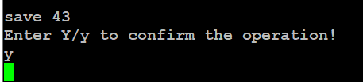

### `load` — загрузить M61

```text
load 01
load ../Programs/DEMO.m61
```

В интерактивном терминале команда загружает программу в память. В M61-сценарии
числовой слот или именованный M61 выполняется как вложенный сценарий и затем
возвращает управление вызывающему файлу.

### `pwd` и `cd` — текущий каталог

```text
pwd
cd /Programs
cd ..
cd
```

`pwd` печатает абсолютный путь. `cd <path>` переходит в существующий каталог,
а `cd` без аргумента возвращает в корень. Текущий путь отображается перед `>` в
каждом приглашении терминала.

### `ls` и `dir` — просмотр каталога

```text
ls
ls /Programs
ls ../README.txt
dir
```

Без аргумента печатаются только непосредственные дети текущего каталога, без
чтения и сортировки всего дерева. Для каталога выводятся строки `d`, для файла
— `f`, размер в байтах и видимое имя с расширением. Аргументом может быть также
один файл. APP перечисляются как обычные узлы C5. `dir` и `fsls` — синонимы
`ls`.

### `mkdir` — создать каталог

```text
mkdir Programs
mkdir -p /Projects/FOCAL/Tests
```

Без `-p` родитель должен существовать. С `-p` недостающие компоненты создаются,
а уже существующий путь считается успехом.

### `mv` — переместить или переименовать

```text
mv DEMO.m61 FINAL.m61
mv FINAL.m61 /Archive
mv /Projects/Old "/Projects/New name"
```

Если назначение — существующий каталог, исходное имя сохраняется. Иначе
последний компонент задаёт новое имя. Тип файла изменять расширением нельзя,
существующее назначение не перезаписывается, каталог нельзя переместить внутрь
собственного поддерева или сделать дерево глубже 32 уровней. APP подчиняются
обычным правилам.

### `rm` и `rmdir` — удалить

```text
rm DEMO.m61
rm -r /Projects/Obsolete
rmdir /Projects/Empty
```

`rm` удаляет файл немедленно. Для каталога требуется явный `rm -r`: дерево
удаляется снизу вверх без рекурсивного расхода стека, после чего печатается
число удалённых объектов. `rmdir` удаляет только пустой каталог. Корень удалить
нельзя. Удаление APP атомарно убирает его из каталога; освободившиеся блоки
позже возвращаются сборщиком мусора. `del` и `fsrm` — синонимы `rm` и также
принимают `-r`.

### `df` — ёмкость и квоты

```text
df
```

Печатает измеренную физическую ёмкость SPI NOR, занятые/свободные/всего узлы,
число видимых файлов и каталогов, служебные directory extents, виртуальный
размер FAT12-кластера и объём сектора, зарезервированный под настройки.
`fsstat` — синоним `df`.

### `fsget` и `fsput` — машинная передача файлов

Эти команды являются транспортом двухпанельного менеджера `tools/mkc.cmd` и
обычно не вводятся вручную. Они передают произвольный поддерживаемый файл C5,
не меняя текущую программу калькулятора:

```text
fsget "/Programs/demo.m61"
fsput begin "/Programs/demo.m61" 128 3141592653
fsput data 0 00112233AABBCCDD
fsput end
fsput cancel
```

`fsget` отвечает строками `@MKC:GET`, `@MKC:DATA` и `@MKC:END`. Загрузка
начинается `fsput begin`, принимает последовательные HEX-блоки не более 96
байт и завершается `fsput end`; ответы — `@MKC:READY`, `@MKC:ACK` и
`@MKC:DONE`. Ошибка имеет вид `@MKC:ERROR <code>`. Для APP код
`PUT_FIRMWARE` означает несовпадение resident-прошивки, а `PUT_APP` —
неверный заголовок, размер, сжатый поток или CRC.

Размер и контрольная сумма проверяются до атомарной записи C5. Контрольная
сумма совпадает с POSIX `cksum`; в неё входит длина файла. Если между блоками
рабочую память занял другой режим, загрузка отклоняется как прерванная. Любая
команда, кроме следующего `fsput`, отменяет незавершённый сеанс. `fsget` и
`fsput` намеренно запрещены внутри M61-сценариев.

Имя назначения обязательно содержит поддерживаемое расширение. Допустимы
`.m61`, `.foc`, `.tbi`, `.txt`, `.state.txt`, `.fmk`, `.wbmp`, `.ch8`, `.app`
и старые
псевдонимы `.t1`, `.m2`, `.wbm`; действуют обычные ограничения C5 по имени и
размеру. CHIP-8 ROM размером от 1 до 3584 байт и APP размером от 64 до
20 544 байт можно передавать по любому пути.

При `fsput` входной APP не хранится целиком в RAM. Прошивка принимает
транспортные блоки последовательно, собирает их в одном 512-байтовом рабочем
буфере и сохраняет под отдельными staging-key. После проверки POSIX `cksum`
контейнер перечитывается потоково. Проверка заголовка, привязки к точному
resident, CRC сохранённых данных, декодирования payload `NONE`/`ZX0` и CRC
готового образа временно использует общий 20-КиБ overlay, но старый C5-файл
в это время ещё не меняется.
Только затем новые динамические блоки и дескриптор публикуются через COW/WAL.
Ошибка оставляет прежний APP доступным; потеря питания даёт после перезапуска
целиком старую либо целиком новую версию. Незавершённые staging-key удаляются
при следующем сеансе или явном `fsput cancel`.

### Совместимые числовые слоты M61

Команды ниже работают только с корневыми M61-файлами `0.m61`…`99.m61` и
сохранены для привычного рабочего процесса.

### `smap` — карта слотов 0…99

```text
smap
```

Карта 10×10 показывает `[X]` для существующей программы M61 с числовым именем
и `[ ]` для свободного номера.

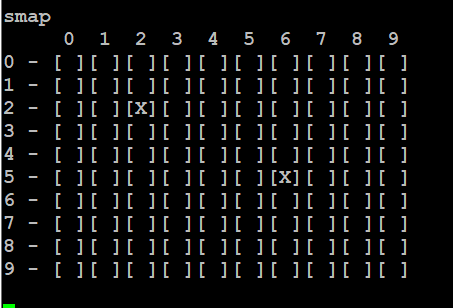

### `sdir` — список числовых слотов

```text
sdir
```

Печатает занятые числовые M61-слоты.

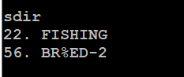

### `snm` — переименовать числовой слот

```text
snm 01 BE-HAPPY
snm 22 FISHING
```

Номер лежит в диапазоне `0`…`99`, новое имя содержит от 1 до 31 байта UTF-8.
Переименование не выполняется, если исходного числового файла нет, имя
недопустимо или видимое FAT-имя уже занято. Для перемещения в каталог
используйте `mv`.

В ранней версии руководства в примерах ошибочно было написано `sname`.
Зарегистрированное имя команды — `snm`.

### `sdel` — удалить числовой слот

```text
sdel 22
Y
```

Команда проверяет существование M61-файла с указанным числовым именем и ждет
отдельную строку `Y`/`y`. `N`/`n` отменяет удаление.

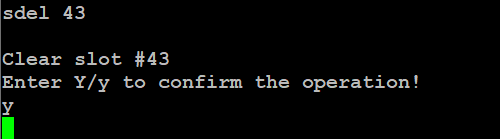

### `sera` — форматировать хранилище

```text
sera
Y
```

Команда форматирует всю C5, а не только числовые M61-слоты. Будут удалены все
файлы и каталоги; зарезервированный журнал настроек сохраняет свою отдельную
область. Требуется отдельное подтверждение `Y`/`y`, отмена — `N`/`n`.

### `fsclean` — удалить пустые записи

```text
fsclean
```

Немедленно удаляет все файлы нулевой длины во всём дереве и печатает их
количество. Полезно после оборванного или некорректного импорта через
виртуальный USB-диск.

### `vlog` — трассировка виртуального FAT

```text
vlog
```

Выводит накопленный журнал USB/VFAT только в сборке с
`MK61_VFAT_TRACE`. В обычной сборке сообщает, что трассировка пуста.

## Сервисные команды

### `prof` — аппаратный профиль времени

```text
prof reset
prof start
prof stop
prof save PROFILE.TXT
prof
```

В поддерживаемой STM32-сборке команда использует счётчик тактов Cortex-M4 DWT
CYCCNT. `start` включает сбор, `stop` останавливает её и печатает статистику,
`reset` очищает все точки, а команда без аргумента печатает текущий снимок.
Для каждой точки выводятся число измерений, минимум, среднее, максимум и сумма
тактов. Частота ядра и измеренная цена самой пары чтений CYCCNT находятся в
заголовке.

Точки `flash.read`, `flash.write`, `flash.verify` и `flash.erase` раздельно
показывают polling-чтение SPI NOR, page program, контрольное чтение после
записи и стирание сектора. Поэтому end-to-end `fsput` может дать выборки
одновременно в `flash.write` и `flash.verify`.

Строки `SPI1` и `SPI1 DMA` показывают состояние владельца общей шины,
сбалансированность захватов и освобождений, число DMA-передач, байтов и входов
в `WFI`, а также fallback, ошибки и timeout. В профилях mini длинные буферы от
128 байт передаются через DMA2 Stream 2/3 Channel 3; короткие команды и адреса
остаются на polling-пути. Физические профили UC1609 пока целиком используют
прежний polling-путь до отдельной проверки общего SPI1 на реальном экране.

Строка `USB CDC RX` показывает защиту входной очереди STM32 USB CDC.
`supported=1, linked=1` означает, что штатная сборка перехватила ошибочный
путь Arduino Core с нулевым приёмным буфером: при заполнении очереди OUT
endpoint отвечает NAK и возобновляется после чтения. `throttles` считает такие
эпизоды backpressure и очищается командами `prof start` и `prof reset`.

Следующая строка `CLASSIC` относится к аппаратному регулятору скорости RUN:
она показывает backend (`TIM9` на STM32F401/F411), фактический период,
состояние таймера, число тиков и исполненных шагов, отброшенные тики, текущую
очередь и её максимум. В нормальном прогоне `missed=0`, а `max_pending` не
превышает 1; очередь аппаратно ограничена двумя шагами, чтобы после долгой
занятости не возникал неограниченный догоняющий рывок. `prof start` и
`prof reset` очищают также эти диагностические счётчики.

Строки `SLEEP` описывают shallow Cortex-M `WFI`: число проверок и фактических
входов, суммарное/минимальное/среднее/максимальное время сна, последнюю маску
блокировки и счётчики причин отказа. Первая консервативная политика разрешает
сон только в верхнем idle остановленного калькулятора. Его запрещают MSC,
непосредственно ожидающая обработка terminal или USB Screen, звук, клавиша или
debounce, CLASSIC, отложенное действие, вложенный viewer/menu и отсутствие
SysTick wake. Сам по себе открытый CDC-порт или подключённый USB Screen больше
не удерживает CPU активным: входящие USB-пакеты будят его прерыванием, а SysTick
не позднее следующего миллисекундного тика запускает обычный scanner всех строк
клавиатуры. STOP/STANDBY и изменение clock tree не используются. `prof start`
и `prof reset` очищают также эти счётчики.

`prof save [path.txt]` останавливает сбор и записывает тот же снимок как
текстовый файл C5; путь по умолчанию — `PROFILE.TXT`. Запись собственного
отчёта не попадает в сохранённые счётчики `flash.write`, поэтому файл остаётся
непротиворечивым и его можно скачать обычной командой `fsget`.

Пока сбор не запущен, каждая точка выполняет только быструю проверку флага.
Размер-чувствительная сборка может полностью удалить профилировщик через
`-DMK61_ENABLE_DWT_PROFILER=0`; тогда команда отсутствует в `help`.
Сам WFI независимо выключается через `-DMK61_ENABLE_IDLE_WFI=0`.

### `crash` — сохранённый аппаратный fault dump

```text
crash
crash show
crash save [path.txt]
crash clear
```

На STM32F401/F411 обработчики HardFault, MemManage, BusFault и UsageFault
записывают в 192-байтную область `.noinit` тип исключения, `pc/lr`, кадр
регистров, MSP/PSP, маски Cortex-M4, `CFSR/HFSR`, адреса fault, reset flags,
режим калькулятора и последние счётчики CLASSIC. Запись защищена CRC и
переживает программную перезагрузку; обработчик fault не обращается к USB,
дисплею, SPI или файловой системе.

При следующем штатном запуске валидная запись автоматически сохраняется в C5
как один из четырёх кольцевых файлов `CRASH0.txt`…`CRASH3.txt`. Если C5 временно
недоступна, SRAM-запись остаётся доступной. `crash` и `crash show` печатают
полный отчёт, `crash save` записывает его по выбранному пути (по умолчанию
`CRASH.TXT`), а `crash clear` явно удаляет только retained SRAM-record. Уже
сохранённые файлы C5 эта команда не удаляет. Когда записи нет, команда
показывает reset flags текущей загрузки и результат проверки `.noinit` layout.

Преднамеренные `crash test ...` существуют только в специальной стендовой
сборке с `MK61_ENABLE_FAULT_INJECTION=1`; в release эти действия и их код
отсутствуют.

### `wdog` — independent watchdog

```text
wdog
wdog status
```

На STM32F401/F411 команда показывает аппаратный backend IWDG, состояние
драйвера, номинальный timeout, число полностью завершённых foreground epoch и
фактических reload, максимальный интервал между ними и отдельный признак
`IWDGRSTF`. Watchdog запускается только в конце `setup()` и кормится в одной
точке после обслуживания USB, terminal, звука, LED и дисплея; обработчики
прерываний его не кормят.

Текущий номинальный timeout — 20 секунд (`prescaler=256`, `reload=2499`). Он
оставляет запас на разброс частоты LSI и на две последовательные 5-секундные
границы ожидания SPI NOR. После watchdog reset строка `WDOG previous` показывает
последний валидный `.noinit` breadcrumb и отличает обычную работу от
преднамеренного стендового зависания. При этом ложный аппаратный fault dump не
создаётся: причина reset и exception — разные диагностические каналы.

Терминальная команда `dfu` при уже работающем IWDG сначала оставляет короткий
retained handoff и выполняет software reset. Следующая ранняя загрузка входит в
системный ROM bootloader до повторного запуска watchdog, поэтому длительная
DFU-прошивка не прерывается.

Действия `wdog test starve` и `wdog test hang` существуют только в специальной
стендовой сборке с `MK61_ENABLE_WATCHDOG_TEST=1`; в release их код и подсказка
отсутствуют.

### `mpu` — аппаратные границы памяти

```text
mpu
mpu status
```

На STM32F401/F411 MPU запрещает доступ к нулевому адресу и ставит
256-байтную недоступную область между статическими данными/heap и
зарезервированным стеком. Команда показывает фактические границы RAM, `_end`,
guard, текущий и минимальный наблюдавшийся MSP и запас над guard. Это
наблюдаемый минимум с момента старта, а не полный анализ high-water для каждой
функции.

На F411 вся SRAM дополнительно помечена execute-never. На F401 исполнение из
SRAM сохраняется, потому что загружаемые System APP действительно запускаются
там; защита нулевого адреса и stack/heap guard при этом остаются. Если linker
разместит статические данные в guard или аппаратных MPU-регионов недостаточно,
защита не включится и `mpu` явно покажет `layout=invalid`/`enabled=0`.

Преднамеренные `mpu test guard|null|exec` доступны только в стендовой сборке с
`MK61_ENABLE_MPU_TEST=1`. В release код этих действий отсутствует; реальные
MemManage-проверки выполнены вместе с сохранением crash dump.

### `uscreen` — внешний USB-экран

```text
uscreen
```

В сборке с `MK61_ENABLE_USB_SCREEN=1` команда переводит firmware в ожидание
handshake с приложением MK61 USB Screen. Desktop-клиент отправляет её
автоматически сразу после открытия CDC-порта, поэтому выбирать пункт меню на
устройстве не требуется. Обычный terminal обслуживается из общего idle-loop,
поэтому команда принимается, когда foreground-интерфейс был открыт с клавиатуры
устройства. Если блокирующий viewer или редактор запущен самой командой
`open`, текущий terminal-вызов ещё не завершён и следующая команда ждёт его
возврата; в таком сценарии сначала выйдите из viewer физической клавишей.
До успешного `ATTACH` физический экран остаётся включённым.

Команда не принимает аргументов и идемпотентна. В сборке с выключенным USB
Screen она отсутствует в `help`. Полное описание handshake, приложения и выхода
находится в `MK61s-mini-USB-Screen.md`.

### `rst` — перезагрузка

```text
rst
```

Подтверждение выполняется на дисплее и клавиатуре самого устройства. После
подтверждения микроконтроллер перезагружается, а USB-порт временно исчезает.

### `dfu` — загрузчик DFU

```text
dfu
```

Команда без дополнительного терминального подтверждения переводит устройство в
режим USB Device Firmware Upgrade. Текущая терминальная сессия сразу
заканчивается. Перед вводом убедитесь, что переход действительно нужен.

## Команды в файлах M61

Строки сценария M61 используют тот же синтаксис, но выполняются с ограниченными
правами. Разрешены:

- управление: `run`, `open`, `load`, `if`, `ret`, `trap`, `bind`;
- программа: `hin`, `set$`, `asm`, `ins`, `list`, `dump`, `pub`, `lasm`,
  `isa`, `hout`;
- калькулятор: `poke`, `R<r>=`, `reg`, `stk`, `1302`, `ring`, `kbd`, `cmd`,
  `reinit`;
- безопасные действия: `ver`, `print`, `wait`, `led`, `beep`.

Метки `:name`, `run :name`, `trap`, `bind` и `ret` существуют только внутри
M61. Новая команда терминала автоматически не получает права сценария. В
частности, `date`, `history`, `crash`, `wdog`, `uscreen`, команды удаления, форматирование,
перезагрузка и DFU в M61 запрещены.

Полный синтаксис, вложенные файлы, метки и ограничения описаны в
`MK61s-mini-M61.md`.

## Подтверждения и осторожность

Терминальное подтверждение отдельной строкой `Y`/`N` используют:

- `clr`;
- `save`;
- `sdel`;
- `sera`.

`rst` подтверждается на самом устройстве. `rm`/`del`/`fsrm`, в том числе
рекурсивный `-r`, а также `mv`, `rmdir`, `fsclean`, `snm` и `dfu` выполняются
без терминального запроса. Для опасных команд проверяйте полный путь и тип файла
до нажатия Enter.

## Что изменилось относительно старой инструкции

- Команда часов `rtc [set ...]` заменена на `date [...]`; при неустановленном
  времени выводится предупреждение `Set the date.`
- Добавлены `help`, `history`, `ring`, `cmd`, `open`, `if`, `led`, `beep`,
  `bind`, `reinit`,
  именованные `save`/`load`, дерево C5 и команды `pwd`, `cd`, `ls`,
  `mkdir`, `mv`, `rm -r`, `rmdir`, `df`, `fsclean` и `vlog`.
- `run` теперь умеет открывать файл, а в M61 — переходить на метку.
- `snm` принимает имя длиной до 31 байта UTF-8; ошибочная форма `sname` удалена
  из примеров.
- Первый аргумент `ins` — десятичный номер шага, второй — hex-opcode.
- `asm` больше не требует завершающего пробела и не изменяет память при ошибке
  разбора.
- Устаревшая команда `exec` удалена; эквивалент клавиши `ПП` — `cmd 53`.
- Подтверждение можно отменить отдельной строкой `N` или `n`.

Для установленной прошивки окончательным источником списка команд остается
команда `help`.
